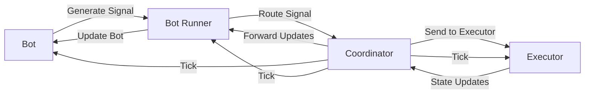
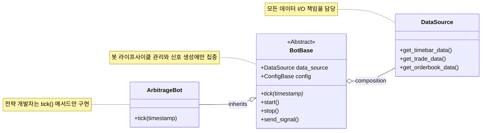

2023년 7월, 저희 팀은 기존에 사용하던 허밍봇(Hummingbot)의 구조적 한계를 극복하기 위해 차세대 트레이딩 시스템, Compound Engine 개발을 시작했습니다. 프로젝트 초기 아키텍처 설계와 프레임워크 개발은 크래프트테크놀로지스에서 대규모 주문 집행 시스템인 AXE를 개발한 배*현 님이 주도하셨습니다. CTO 김*수 님과 핵심 개발자 김*진 님은 전략 개발과 프레임워크 개발을 병행했습니다. 2023년 12월 배*현 님 퇴사 이후, 김*진 님께서 메인 개발자로 프로젝트를 이끌게 되었고, 저는 2024년 4월부터 합류하여 백테스트 모듈 개발과 `BotBase` 클래스의 리팩토링 등을 담당하게 되었습니다.

Compound Engine의 핵심 설계 철학은 <b>관심사의 분리(Separation of Concerns)</b>에 기반한 <b>신호 생성(Bot)과 거래 실행(Executor)의 완벽한 분리</b>입니다. 기존 허밍봇 V1에서는 신호 생성과 주문 실행 로직이 하나의 전략 모듈 안에 강하게 얽혀있는 구조였습니다. 저희는 이 문제를 해결하고 다음과 같은 아키텍처의 이점을 얻고자 새로운 시스템을 설계했습니다.

  * **모듈화된 개발과 단일 책임 원칙**: 퀀트 리서처는 순수한 신호 생성 로직에만 집중하고, 백엔드 엔지니어는 주문 라우팅 및 체결 최적화 인프라를 독립적으로 발전시킬 수 있습니다.
  * **코드 재사용성 극대화**: 중앙화된 주문 실행 엔진(Executor)을 모든 전략에서 공유하여 중복 코드를 없애고 개발 효율을 높입니다.
  * **정교하고 최적화된 주문 관리**: 중앙화된 실행 엔진을 통해 슬리피지를 줄이고, 부분 체결을 관리하는 등 한층 정교한 주문 및 포지션 관리가 가능해집니다.

시스템은 액터 모델(Actor Model) 기반으로 구성되어 있으며, 주요 액터 간의 메시지 흐름은 다음과 같습니다. `Bot`은 `Coordinator`로부터 주기적인 `tick` 메시지를 받아 신호를 만들고, 이 신호는 `Bot Runner`와 `Coordinator`를 거쳐 `Executor`로 전달되어 실제 거래가 이루어집니다.



이 글에서는 제가 맡았던 `BotBase` 클래스의 리팩토링 과정을 중심으로, 어떻게 코드의 복잡성을 낮추고 확장성과 안정성을 높였는지 상세히 공유해 보려 합니다.

-----

## 기존 BotBase의 구조적 한계: '만능 클래스'가 된 BotBase

리팩토링 이전의 `BotBase` 클래스는 하나의 클래스가 너무 많은 책임을 짊어지고 있는, 이른바 <b>거대 클래스 안티패턴</b>의 모습을 보이고 있었습니다.

### 문제점 1: 과도한 의존성과 복잡한 생성자

가장 먼저 눈에 띄는 문제는 생성자부터 너무 많은 의존성을 직접 주입받고 있다는 점이었습니다. 이는 코드의 결합도를 높이고 테스트를 어렵게 만드는 직접적인 원인이었습니다.

```python
# Before: 과도한 의존성과 복잡한 생성자
class BotBase(ActorBase):
    def __init__(
        self,
        coordinator_channel: ActorChannel,
        mode: Mode | str,
        config: ConfigBase,
        bot_runner_channel: ActorChannel,
        bot_manager_msg: BotManagerMsg | None = None,
        max_running_cycles: int = 1,
        db_connector: SQLAlchemyConnectorBase | None = None,  # 데이터베이스 의존성
        smb_file_manager: SMBFileManager | None = None,  # 파일 시스템 의존성
        smb_data_path_generator: type[DataPathGeneratorBase] | None = None,
    ):
        # 복잡한 초기화 로직...
```
{: .nolineno }

### 문제점 2: 단일 책임 원칙(SRP)의 위배

더 큰 문제는 `BotBase` 안에 데이터 브로커 생성, 데이터 리더 준비, 그리고 각종 데이터(`TimeBar`, `Trade` 등) 조회 메서드까지 직접 구현되어 있었다는 점입니다. 이는 <b>단일 책임 원칙(Single Responsibility Principle)</b>을 위반하는 구조였습니다.

```python
# Before: BotBase가 너무 많은 책임을 담당
class BotBase(ActorBase):
    def run_data_broker(self):
        # 데이터 브로커 생성 로직
        return DataBroker(
            db_connector=self.db_connector,
            smb_file_manager=self.smb_file_manager,
            smb_data_path_generator=self.smb_data_path_generator,
            coordinator_channel=self.coordinator_channel,
        )

    async def prepare_data_readers(self):
        # 데이터 리더 준비 로직
        data_broker = self.run_data_broker()
        tasks = []
        for data_config in self.config.get_data():
            # 복잡한 데이터 리더 생성 로직...
        
    async def get_timebar_data(self, market: Market, since_timestamp: float, 
                              until_timestamp: float, interval: int | None = None):
        # 직접적인 데이터 워커 채널 관리 및 저수준 통신 로직
        channel = self.data_worker_channels.get((market, DataReaderType.TimeBar))
        return await channel.request_and_response(
            GetTimeBarData(since=since_timestamp, until=until_timestamp, interval=interval)
        )
    
    # get_trade_data, get_orderbook_data 등 수많은 데이터 메서드들...
```
{: .nolineno }

이러한 구조는 몇 가지 문제점을 낳았습니다.

1.  <b>높은 결합도(High Coupling)</b>: `BotBase`가 데이터베이스, 파일 시스템 등 다양한 인프라 구성 요소와 직접적으로 얽혀 있었습니다.
2.  <b>테스트의 복잡성(Low Testability)</b>: 단위 테스트를 하려면 이 모든 외부 의존성을 일일이 모의(Mocking) 처리해야 하는 부담이 컸습니다.
3.  <b>확장성 제약(Low Scalability)</b>: 새로운 데이터 소스를 추가할 때마다 `BotBase` 클래스 자체를 수정해야 하므로 <b>개방-폐쇄 원칙(OCP)</b>을 지키기 어려웠습니다.
4.  **코드 가독성 저하**: 핵심 비즈니스 로직과 인프라 코드가 뒤섞여 있어, 전략을 개발하는 리서처가 코드를 파악하는 데 드는 정신적 비용을 높였습니다.

-----

## 리팩토링 전략: 역할 분리와 의존성 역전

이 문제들을 해결하기 위해 **SOLID 원칙**, 그중에서도 특히 <b>단일 책임 원칙(SRP)</b>과 <b>의존성 역전 원칙(DIP)</b>에 기반해 리팩토링을 진행했습니다. 핵심 전략은 `BotBase`가 짊어지고 있던 '데이터 처리'라는 무거운 짐을 완전히 분리해 내는 것이었습니다. 이를 통해 각 클래스의 역할은 명확히 하고, 응집도는 높이며 결합도는 낮추고자 했습니다.



### DataSource 클래스 도입

리팩토링의 가장 핵심적인 변화는 데이터 관련 복잡성을 모두 감싸 안는 **DataSource 클래스**의 도입이었습니다. `DataSource`는 데이터 워커 생성, DB 및 파일 시스템 연결, 데이터 요청과 수신 등 모든 데이터 I/O를 책임집니다. 덕분에 `BotBase`의 생성자는 `DataSource` 하나만 주입받도록 바뀌어 아주 간결해졌습니다.

```python
# After: 의존성이 DataSource로 완전히 분리된 BotBase
class BotBase(ActorBase):
    def __init__(
        self,
        coordinator_channel: ActorChannel,
        mode: Mode,
        config: ConfigBase,
        data_source: DataSource,  # 단일 의존성으로 통합
        bot_runner_channel: ActorChannel,
        bot_manager_msg: BotManagerMsg | None = None,
    ) -> None:
        super().__init__(coordinator_channel)
        self.mode = mode
        self.config = config
        self.data_source = data_source # DataSource가 데이터 관련 의존성을 모두 관리
        self.bot_runner_channel = bot_runner_channel
        # 간결해진 초기화 로직...
```
{: .nolineno }

`DataSource`는 내부에 데이터 관련 의존성을 모두 품고, 비동기 초기화 및 데이터 워커 채널 생성 로직을 알아서 관리합니다.

```python
class DataSource:
    def __init__(
        self,
        coordinator_channel: ActorChannel,
        db_connector: SQLAlchemyConnectorBase | None = None,
        smb_file_manager: SMBFileManager | None = None,
        smb_data_path_generator: type[DataPathGeneratorBase] | None = None,
        ml_model_data_path: Path = settings.ML_MODEL_DATA_PATH,
    ) -> None:
        # 의존성 초기화 및 기본값 설정
        self.coordinator_channel = coordinator_channel
        self.db_connector = db_connector or PostgreSQLAlchemyConnector.init_with_settings()
        self.smb_file_manager = smb_file_manager or init_smb_file_manager_with_settings()
        self.smb_data_path_generator = smb_data_path_generator or DataPathGenerator
        self.ml_model_data_path = ml_model_data_path
        
        # 내부 상태 관리
        self.bot_channel: ActorChannel | None = None
        self.data_broker: DataBroker | None = None
        self.data_worker_channels: dict[(Market, DataReaderType), ActorChannel] = {}

    async def init(self, bot_channel: ActorChannel, configs: list[DataConfig.Value]) -> None:
        """데이터 워커 채널들을 초기화하고 브로커를 설정"""
        self.bot_channel = bot_channel
        self.data_broker = self.init_data_broker()
        self.data_broker_channel = self.data_broker.get_channel()
        self.data_worker_channels = await self.create_data_worker_channels(configs)
```
{: .nolineno }

### 전략 패턴(Strategy Pattern)을 통한 확장성 확보

`DataSource` 내부에서는 **전략 패턴**을 활용하여 다양한 데이터 타입을 체계적으로 다룹니다. 덕분에 새로운 데이터 타입이 추가되더라도 기존 코드를 수정할 필요 없이 유연하게 확장할 수 있어 <b>개방-폐쇄 원칙(OCP)</b>을 자연스럽게 지킬 수 있게 되었습니다.

```python
@property
def request_method_by_data_type(self) -> dict[DataReaderType, Callable[[DataConfig.Value], Request]]:
    """각 데이터 타입별 요청 메서드를 매핑하는 전략 맵"""
    return {
        DataReaderType.TimeBar: self._create_timebar_data_reader_request,
        DataReaderType.Trade: self._create_trade_data_reader_request,
        DataReaderType.Orderbook: self._create_orderbook_data_reader_request,
        DataReaderType.VolumeBar: self._create_volumebar_candle_data_reader_request,
        DataReaderType.Liquidation: self._create_liquidation_data_reader_request,
        # ... 등 다양한 데이터 타입
    }

def _get_request_method_by_data_type(self, data_type: DataReaderType) -> Callable[[DataConfig.Value], Request]:
    """타입 안전성을 보장하는 요청 메서드 조회"""
    try:
        return self.request_method_by_data_type[data_type]
    except KeyError:
        raise UnknownDataTypeError(f"Unknown data type {data_type}")
```
{: .nolineno }

-----

## 재탄생한 BotBase

리팩토링을 통해 `BotBase`는 본연의 임무인 **봇의 생명주기 관리**와 **핵심 전략 실행을 위한 인터페이스 제공**에만 집중하는, 가볍고 명확한 클래스로 거듭났습니다.

### 간결해진 전략 개발 인터페이스

이제 전략을 만드는 리서처는 복잡한 인프라 코드를 들여다볼 필요가 없습니다. 추상 메서드인 `tick()` 안에서 `self.data_source`를 통해 필요한 데이터를 손쉽게 조회하고, 전략 로직을 구현한 뒤 신호를 시스템에 보내기만 하면 됩니다.

```python
class ArbitrageBot(BotBase):
    async def tick(self, timestamp: float) -> None:
        # 1. DataSource를 통한 데이터 조회
        timebars = await self.data_source.get_timebar_data(...)
        trades = await self.data_source.get_trade_data(...)

        # 2. 전략별 신호 생성 로직
        if self.should_buy(timebars, trades):
            signal = self.create_buy_signal()
            # 3. 결정된 신호 전송
            await self.send_signal(signal, "Buy Signal Triggered")
```
{: .nolineno }

### 명확한 네이밍 컨벤션 정립

코드의 가독성과 일관성을 높이기 위해, 메시지 처리와 관련된 메서드의 네이밍 컨벤션을 명확히 규정했습니다. 기존 코드에서는 `_on_{method_name}`과 `on_{method_name}`이 혼재되어 사용되었고, 그 역할 구분이 모호했습니다.

저는 다음과 같이 세 단계로 역할을 나누어 컨벤션을 정의했습니다.

| 메서드 네이밍 패턴     | 역할과 책임                                                                                                               |
| :--------------------- | :------------------------------------------------------------------------------------------------------------------------ |
| **`on_{method_name}`** | **메시지 수신 지점**: 외부 메시지를 받으면 가장 먼저 실행됩니다. 메시지 처리의 성공/실패 여부를 응답하는 역할도 맡습니다. |
| **`_{method_name}`**   | **내부 공통 처리**: 핵심 로직 실행 전후의 공통 작업(상태 검증, 예외 처리, 로깅 등)을 담당합니다.                          |
| **`{method_name}`**    | **핵심 비즈니스 로직**: 실제 전략을 구현하는 추상 메서드로, 개발자가 필요에 맞게 오버라이드합니다.                        |

예를 들어, `BotStopCommand` 메시지를 처리하는 과정은 다음과 같습니다.

1.  `on_receive_msg`는 `BotStopCommand`를 받고 `on_stop`을 호출합니다.
2.  `on_stop`은 `_stop` 메서드를 `try-except` 블록으로 감싸 실행합니다. `_stop`이 성공하면 성공 응답을, 실패하면 실패 응답을 `BotManager`로 전송합니다.
3.  `_stop`은 봇의 `is_running` 상태를 `False`로 변경하고, 리서처가 구현할 수 있는 `stop` 메서드를 호출한 뒤, 로깅과 같은 후처리 작업을 수행합니다.
4.  `stop`은 기본적으로 아무 동작도 하지 않는 빈 메서드이며, 리서처가 봇 중지 시 특별한 정리 작업이 필요할 경우 이 메서드를 오버라이드하여 구현합니다.

```python
# stop 관련 메서드 호출 흐름 예시
async def on_stop(self, msg: BotStopCommand) -> bool:
    try:
        await self._stop()
        await self.send_success_command_result(msg.bot_manager_msg)
        return True
    except Exception as e:
        # ... 실패 처리 ...
        return False
        
async def _stop(self) -> None:
    self.is_running = False
    await self.stop() # 리서처가 구현할 수 있는 부분
    self.logger.info(self.build_log("Stopped bot."))
        
async def stop(self) -> None:
    # 리서처가 필요에 따라 오버라이드
    pass
```
{: .nolineno }

`tick` 관련 메서드 또한 이 컨벤션에 맞게 `on_tick`, `_tick`, `tick`이라는 명확한 계층 구조를 따르게 됩니다.

```python
# 틱 처리 메서드의 계층 구조
async def on_tick(self, msg: Tick) -> None:
    """틱 메시지 수신 시 엔트리 포인트"""
    start_time = time.time()
    await self._tick(msg.timestamp)
    # 성능 모니터링 및 로깅 로직
        
async def _tick(self, timestamp: float) -> None:
    """틱 처리 전후의 공통 검증 로직"""
    if not self.can_process_tick(timestamp):
        await super()._tick(timestamp)
        return

    if not self.is_running:
        self.logger.warning(self.build_log("Bot is not running"))
        await super()._tick(timestamp)
        return

    try:
        await self.tick(timestamp)  # 전략별 핵심 로직 호출
    except Exception as e:
        self.logger.error(self.build_log("Tick processing failed", error=e), exc_info=True)

    await super()._tick(timestamp)

@abstractmethod
async def tick(self, timestamp: float) -> None:
    """전략 개발자가 구현해야 할 핵심 로직"""
    self._current_timestamp = timestamp
    # 실제 전략 로직은 서브클래스에서 구현
```
{: .nolineno }

더 나아가, `start_strategy`, `patch_config_strategy` 와 같이 기존에 `on_` 접두사 없이 사용되던 메시지 처리 메서드들도 `on_start`, `on_patch` 등으로 일관성 있게 변경하여 코드 전체의 통일성을 확보했습니다.

-----

## 데이터 인터페이스 표준화

기존 데이터 조회 메서드들은 파라미터 구조가 제각각이었습니다.

**어떤 문제가 있었을까요?**

  * `get_rate_data`에 조회 종료 시점을 지정하는 `data_till` 파라미터가 없어 비효율적인 반복 조회가 필요했습니다.
  * 일부 메서드에만 있던 `latest` 파라미터는 SQL 쿼리에 `ORDER BY` 절이 없어 이름과 달리 정확한 최신 데이터를 보장하지 못했습니다.
  * 메서드마다 다른 파라미터 구조는 코드를 배우고 사용하는 것을 더 어렵게 만들었습니다.

이러한 문제들을 해결하고자 모든 데이터 조회 메서드의 시그니처를 일관되게 표준화했습니다.

**표준화된 시그니처:**

| 메서드명             | data\_since | data\_till | is\_return\_required | 비고                      |
| :------------------- | :---------- | :--------- | :------------------- | :------------------------ |
| get\_orderbook\_data | ✓           | ✓          | ✓                    | 표준 시그니처             |
| get\_timebar\_data   | ✓           | ✓          | ✓                    | `latest` 매개변수 제거    |
| get\_volumebar\_data | ✓           | ✓          | ✓                    | `latest` 매개변수 제거    |
| get\_rate\_data      | ✓           | ✓          | ✓                    | `data_till` 매개변수 추가 |

-----

## 테스트 도입 및 안정성 확보

리팩토링의 가장 중요한 원칙 중 하나는 "기존의 동작을 변경하지 않는다"입니다. 하지만 제가 프로젝트에 합류했을 당시에는 테스트 코드가 전무하여, 리팩토링이 시스템의 안정성을 해칠 수 있는 위험을 안고 있었습니다. 따라서 `BotBase`, `DataSource` 등 핵심 컴포넌트에 대한 단위 및 통합 테스트 스위트를 마련하여 코드의 신뢰도를 높였습니다.

### 테스트 환경 구축

`conftest.py`에 인메모리 SQLite DB와 테스트용 `DataSource` 인스턴스처럼, 테스트에 필요한 여러 픽스처(fixture)를 미리 정의해두었습니다.

```python
@pytest.fixture
async def _engine() -> AsyncGenerator[AsyncEngine, None]:
    """인메모리 SQLite 엔진 생성 및 스키마 초기화"""
    engine = create_async_engine("sqlite+aiosqlite:///:memory:")
    async with engine.begin() as conn:
        await conn.run_sync(Base.metadata.create_all)

    try:
        yield engine
    finally:
        await engine.dispose()
        async with engine.begin() as conn:
            await conn.run_sync(Base.metadata.drop_all)

@pytest.fixture
def db_connector(_engine: AsyncEngine) -> SqliteSQLAlchemyConnector:
    """테스트용 데이터베이스 커넥터"""
    return SqliteSQLAlchemyConnector(engine=_engine)

@pytest.fixture
def data_source(
    coordinator_channel: ActorChannel,
    db_connector: SqliteSQLAlchemyConnector,
    smb_file_manager: SMBFileManager,
    smb_data_path_generator: type[DataPathGeneratorBase],
) -> DataSource:
    """테스트용 DataSource 인스턴스 생성"""
    return DataSource(
        coordinator_channel=coordinator_channel,
        db_connector=db_connector,
        smb_file_manager=smb_file_manager,
        smb_data_path_generator=smb_data_path_generator,
        ml_model_data_path=ML_MODEL_FIXTURE_PATH,
    )
```
{: .nolineno }

### 가짜 객체

`SMBFileManager`와 같은 외부 시스템 의존성은 `FakeSMBFileManager`와 같은 가짜 객체(Fake Object)로 대체하여 `DataSource`를 독립적으로 테스트할 수 있도록 했습니다.

```python
class FakeSMBFileManager(SMBFileManager):
    def __init__(
        self,
        data_root_path: str = str(TARDIS_FIXTURE_PATH),
        cache_path: str = str(SMB_CACHE_ROOT_PATH),
        cache_ttl: int = SMBFileManager.DEFAULT_CACHE_TTL,
        max_cache_size: int = SMBFileManager.DEFAULT_MAX_CACHE_SIZE,
    ):
        super().__init__(
            "fake_username",
            "fake_password",
            "fake_remote_name",
            cache_path,
            cache_ttl,
            max_cache_size,
        )

        self.data_root_path = Path(data_root_path)

    def copy(self, share_name: str, file_path: str, target_path: str) -> None:
        file_full_path = self.data_root_path / share_name / file_path

        shutil.copy(str(file_full_path), target_path)

        now = datetime.datetime.utcnow()
        os.utime(target_path, (now.timestamp(), now.timestamp()))

class FakeDataPathGenerator(DataPathGenerator):
    def _get_dir_path(self) -> Path:
        return Path()
```
{: .nolineno }

### 상세한 테스트 케이스 작성

`BotBase`의 생명주기(`start`, `stop`, `patch` 등)와 각 메시지 처리(`on_start`, `on_stop`, `on_tick` 등)에 대한 테스트 케이스를 작성하여 모든 시나리오를 검증했습니다.

```python
# BotBase 생명주기 테스트
async def test_start(bot: FakeBot, config: DummyConfig) -> None:
    """봇 시작 시 모든 의존성이 올바르게 초기화되는지 검증"""
    timestamp = 12345
    bot.start = AsyncMock()

    await bot._start(timestamp)

    assert bot.is_running
    assert bot.start_timestamp == timestamp
    assert bot.data_source.bot_channel == bot.channel
    assert isinstance(bot.data_source.data_broker, DataBroker)
    assert len(bot.data_source.data_worker_channels.keys()) == len(config.get_data())
    bot.start.assert_called_once()

# BotBase 틱 처리 테스트
async def test_tick_processing_flow(bot: FakeBot) -> None:
    """틱 처리 플로우의 정상 동작 검증"""
    timestamp = 12345
    bot.tick = AsyncMock()

    await bot._start(timestamp)
    await bot._tick(timestamp)

    bot.tick.assert_called_once_with(timestamp)
```
{: .nolineno }

`DataSource`에 대해서는 지원하는 모든 데이터 타입(`TimeBar`, `VolumeBar`, `Orderbook` 등)에 대한 데이터 조회 기능을 각각 테스트했습니다.

```python
# DataSource 데이터 조회 기능 테스트
async def test_get_timebar_data(data_source: DataSource, market: Market) -> None:
    """캔들 데이터 조회 기능 테스트 (테스트용으로 셋업된 SMB 파일 픽스처 사용)"""
    data_interval = 60

    data = await data_source.get_timebar_data(
        market=market,
        since_timestamp=create_datetime(2024, 1, 1, 0, 1).timestamp(),
        until_timestamp=create_datetime(2024, 1, 1, 0, 2).timestamp(),
        interval=data_interval,
    )

    assert len(data) == 2
    assert data[0].data.close_price == 42350.4
    assert data[0].data.volume == 202.444
    assert data[1].data.close_price == 42360.2
    assert data[1].data.volume == 271.521

async def test_get_volumebar_data(
    data_source: DataSource,
    market: Market,
    db_connector: SqliteSQLAlchemyConnector,
) -> None:
    """볼륨캔들 데이터 조회 기능 테스트 (데이터베이스 종단 간 테스트)"""
    # 테스트 데이터 설정
    exchange = market.exchange
    symbol = market.pair
    interval = "1000"

    volumebars = [
        VolumeCandle(
            id=1,
            symbol=symbol,
            exchange=exchange,
            interval=interval,
            datetime=create_datetime(2024, 3, 1, 0, 0),
            end_datetime=create_datetime(2024, 3, 1, 0, 1),
            open=0.743,
            high=0.744,
            low=0.743,
            close=0.744,
            volume=865.1,
            trade_count=None,
        ),
        # 추가 테스트 데이터...
    ]

    # 데이터베이스에 테스트 데이터 삽입
    async with db_connector.session_factory() as session:
        session.add_all(volumebars)
        await session.commit()

    # 실제 데이터 조회 및 검증
    data = await data_source.get_volumebar_data(
        market=market,
        since_timestamp=create_datetime(2024, 3, 1, 0, 1).timestamp(),
        until_timestamp=create_datetime(2024, 3, 1, 0, 2).timestamp(),
        interval=interval,
    )

    assert len(data) == 2
    assert data[0].data.close_price == 0.743
    assert data[1].data.trade_count == 25
```
{: .nolineno }

-----

## 리팩토링 결과와 효과

이번 리팩토링을 통해 코드 품질, 개발 생산성, 시스템 안정성 등 여러 면에서 의미 있는 개선을 이룰 수 있었습니다.

### 정량적 개선 효과

  * <b>`BotBase` 클래스 코드 라인(LOC) 63% 감소</b> (약 815줄 → 305줄)
  * **의존성 수 33% 감소** (9개 → 6개)
  * **테스트 커버리지 0% → 35% 달성**

### 정성적 개선 효과

  * **아키텍처 품질 향상**: **단일 책임, 의존성 역전, 개방-폐쇄 원칙**을 지키면서 각 클래스의 역할이 명확해졌고, 테스트와 확장에도 용이한 구조가 되었습니다.
  * <b>개발자 경험(DX) 개선</b>: `tick()` 메서드 구현에 집중해야 하는 점은 이전과 같지만, 리서처가 `BotBase`의 내부 동작을 더 쉽게 이해할 수 있게 되어 핵심 로직 개발에 더욱 몰입할 수 있게 되었습니다. 일관된 데이터 인터페이스와 명확한 네이밍 덕분에 코드를 익히는 과정도 한결 수월해졌습니다.
  * **시스템 안정성 증대**: 꼼꼼한 테스트 코드는 예기치 않은 오류 발생 가능성을 줄여줍니다.

## 결론

`BotBase` 리팩토링은 **소프트웨어 공학의 기본 원칙을 적용하여 복잡했던 클래스를 가볍고 명확하며 테스트하기 좋은 모듈로 재탄생시키는 과정**이었습니다. 이번 리팩토링을 통해 `BotBase`의 구조가 명확해지면서, 리서처들은 데이터 인프라의 복잡한 내부 구현을 파악해야 하는 부담을 덜고 전략 개발이라는 본질에 더욱 집중할 수 있는 환경을 갖추게 되었습니다. 여기에 **명확한 네이밍 컨벤션을 정립**하고 **데이터 인터페이스를 표준화**한 작업은, 동료 개발자 누구나 코드를 쉽게 이해하고 안전하게 수정할 수 있는 기반이 되어 장기적인 가독성과 유지보수성을 향상시켰습니다.
