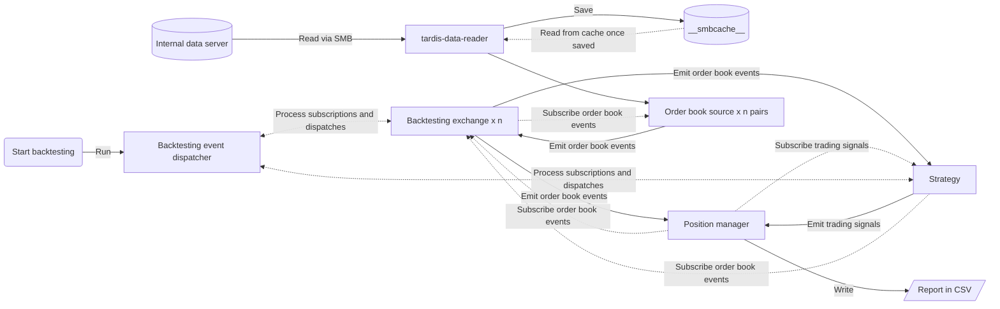

2023년 8월, 제가 속한 팀에서는 크래프트테크놀로지스의 대규모 주문 집행 시스템 AXE 개발을 주도하셨던 배*현 님의 리드 하에 자체 트레이딩 시스템인 **Compound Engine**을 개발하고 있었습니다. 이 시기, Compound Engine의 핵심 파트 중 하나인 **Signal Generator**가 완성 단계에 접어들었습니다. Signal Generator는 다음과 같은 형식으로 시그널을 생성합니다.

```yaml
# 현물/선물 차익거래 전략을 위한 시그널 예시
- id: 1
  timestamp: 1669852800
  strategy_name: SpotPerpetualArbitrage
  exchange1: bybit
  pair1: BTC-USDT
  exchange2: binance_perpetual
  pair2: BTC-USDT
  entry_rate: 0.0001
  take_profit_rate: 0.0005
  stop_loss_rate: 0.00002
- id: 2
  timestamp: 1669852801
  strategy_name: SpotPerpetualArbitrage
  entry_time_limit: 2.0
  exchange1: bybit
  pair1: BTC-USDT
  exchange2: binance_perpetual
  pair2: BTC-USDT
  entry_rate: 0.0001
  take_profit_rate: 0.0007
  stop_loss_rate: 0.00002
# ...
```
{: .nolineno }

저에게 주어진 과제는 이 시그널들의 실제 성과를 검증할 수 있는 백테스팅 모듈을 개발하는 것이었습니다. 요구사항은 **Tardis**에서 제공하는 실제 오더북 데이터를 사용하여 최대한 현실에 가깝게 시뮬레이션해야 한다는 점이었습니다. 암호화폐 시장의 거래소 간 차익거래 전략을 정밀하게 검증하기 위해서는 틱(tick) 단위의 시뮬레이션이 이상적이지만, 저희 전략의 특성을 고려했을 때 1초 단위 데이터로도 충분한 정확도를 확보할 수 있다고 판단했습니다. 그렇게 1초 단위 오더북을 기반으로 한 백테스팅 모듈 개발 프로젝트가 시작되었습니다.

-----

## 백테스팅 방법론: 이벤트 기반 방식을 선택한 이유

백테스팅은 크게 벡터 기반(Vectorized) 방식과 이벤트 기반(Event-driven) 방식으로 나뉩니다. 각 방식의 특징은 명확한 장단점을 가집니다.

| 구분               | 벡터 기반 백테스팅 (Vectorized Backtesting)                            | 이벤트 기반 백테스팅 (Event-driven Backtesting)                                 |
| ------------------ | ---------------------------------------------------------------------- | ------------------------------------------------------------------------------- |
| **데이터 처리**    | 모든 데이터를 한 번에 벡터/행렬 연산으로 처리 (예: `pandas`, `numpy`)  | 데이터를 시간 순서에 따라 하나씩 (이벤트별로) 처리하는 루프 방식                |
| **속도**           | **매우 빠름**                                                          | 상대적으로 느림                                                                 |
| **현실성**         | **낮음** (단순한 시장가 주문 가정, 슬리피지/거래비용 등 반영 어려움)   | **매우 높음** (실제 거래와 유사하게 지정가, 슬리피지, 부분 체결 등 모델링 가능) |
| **구현 복잡성**    | **낮음** (코드가 간결하고 구현이 쉬움)                                 | **높음** (구조가 복잡하고 개발 시간이 오래 걸림)                                |
| **미래 참조 편향** | 발생 위험 높음 (데이터 전체를 보므로 실수로 미래 정보를 사용하기 쉬움) | 발생 위험 낮음 (시간 순서대로 데이터를 보므로 미래 정보를 볼 수 없음)           |
| **적합한 전략**    | 저빈도 매매, 간단한 로직의 전략을 빠르게 테스트할 때                   | 고빈도 매매, 복잡한 주문 유형, 경로 의존적인 전략을 정밀하게 테스트할 때        |

저는 두 방식 중 **이벤트 기반 백테스팅**을 선택했습니다. 여기에는 두 가지 이유가 있었습니다.

1.  **전략의 복잡성과 현실성**: 저희가 검증하려는 전략은 **한 거래소에 지정가 주문을 내고, 체결이 확인되면 해당 수량만큼 다른 거래소에 시장가 주문을 내는** 복잡한 경로 의존적(path-dependent) 로직을 가집니다. 벡터 기반 방식으로는 이러한 조건부 순차 실행, 부분 체결, 슬리피지 등을 현실적으로 모델링하는 것이 거의 불가능합니다. 이벤트 기반 방식만이 실제 거래와 유사한 수준의 시뮬레이션이 가능했습니다.

2.  **메모리 효율성**: 1초 단위의 25레벨 오더북 데이터는 그 규모가 상당합니다. 두 개 거래소의 1년치 데이터만 해도 메모리에 한 번에 로드할 경우 약 50GB에 달하는 공간을 차지합니다. 벡터 기반 방식은 이 모든 데이터를 메모리에 올려야 하므로 사실상 실행이 불가능했습니다. 반면, 이벤트 기반 방식은 데이터를 순차적으로 읽어와 처리하므로 테스트 기간과 관계없이 거의 일정한 수준의 낮은 메모리 사용량을 유지할 수 있어 대용량 데이터 처리에 훨씬 적합했습니다.

-----

## 개발 전략 수립

소규모 스타트업의 빠른 개발 사이클 속에서 이번 과제 역시 "완벽하고 탄탄한 프레임워크 구축"보다는 "신속한 백테스팅 결과 도출"에 무게가 실려 있었습니다. 주어진 시간은 약 1~2주. 이 짧은 시간 안에 복잡한 이벤트 기반 백테스팅 모듈을 완성하는 것은 분명 큰 도전이었습니다.

먼저, 관련 자료 리서치에 착수했습니다. 해외 퀀트 교육 기관인 `quantstart`에서 제공하는 이벤트 기반 백테스팅 구현에 대한 상세한 시리즈 아티클을 정독하며 기반 지식을 다졌습니다.

  - [quantstart.com/articles/Event-Driven-Backtesting-with-Python-Part-I](https://www.quantstart.com/articles/Event-Driven-Backtesting-with-Python-Part-I) \~ Part-VIII

이 글들을 기반으로 구현된 여러 GitHub 저장소도 참고할 수 있었습니다.

  - [github.com/tobiasbrodd/backtester](https://github.com/tobiasbrodd/backtester)
  - [github.com/DavidCico/Enhanced-Event-Driven-Backtester](https://github.com/DavidCico/Enhanced-Event-Driven-Backtester)

동시에, 기존에 존재하는 오픈소스 프레임워크도 검토했습니다. 가장 널리 알려진 `backtrader`와 `PyAlgoTrade`는 아쉽게도 주로 캔들(OHLCV) 데이터 기반으로 설계되어, 오더북 데이터를 직접 지원하거나 그에 맞는 체결 로직을 제공하지 않았습니다.

그러던 중, `PyAlgoTrade`의 개발자가 새롭게 선보인 `basana`라는 프레임워크가 오더북 기반 체결 기능을 지원한다는 사실을 발견했습니다. 이제 선택지는 두 가지로 좁혀졌습니다.

1.  `quantstart` 아티클을 기반으로 처음부터 직접 구현한다.
2.  `basana` 프레임워크를 기반으로 필요한 기능을 수정하고 확장한다.

결론적으로 저는 두 번째 안을 선택할 수밖에 없었습니다.

1.  **시간적 제약**: 1~2주 안에 모든 것을 바닥부터 구현하는 것은 현실적으로 불가능에 가까웠습니다.
2.  **코드 품질**: `quantstart`의 예제 코드는 교육용으로는 훌륭했지만, `basana`의 소스 코드는 실제 프로덕션 환경을 고려한 구조와 완성도를 갖추고 있었습니다.
3.  **개발 효율성**: `basana`의 핵심 구조를 유지하면서 필요한 부분만 수정하면 1주일 내로 초기 목표를 달성할 수 있을 것이라 판단했습니다.

물론, 이 결정에는 트레이드오프가 따랐습니다. 당초 구상했던 가장 이상적인 형태의 체결 로직 일부는 포기해야 했고, 예상보다 훨씬 많은 부분을 수정하고 새로 구현해야 했습니다. 하지만 결과적으로 1주일 만에 동작하는 백테스팅 모듈의 첫 버전을 완성할 수 있었습니다. 지금부터 그 과정에서 어떤 부분을 수정하고 추가했는지 상세히 이야기해 보겠습니다.

-----

## Basana 프레임워크 확장 및 커스터마이징

### 1\. Parquet 포맷 지원: 커스텀 이벤트 소스 구현

저희 팀은 Tardis에서 받은 틱 데이터를 1초 단위로 리샘플링하여 Parquet 포맷으로 저장 및 관리하고 있었습니다. 하지만 `basana`는 기본적으로 CSV 파일만 이벤트 소스로 지원했습니다. 따라서 가장 먼저 Parquet 파일을 읽어들일 수 있는 커스텀 `EventSource`를 구현해야 했습니다.

이 `EventSource`는 일자별로 저장된 Parquet 파일을 순차적으로 읽어, 데이터 한 줄(row)마다 `OrderBookEvent`를 생성하여 이벤트 큐로 보내는 역할을 합니다.

```python
# 데이터를 비동기적으로 읽고, 1초 단위로 리샘플링하여 이벤트를 생성하는 제너레이터 함수
def load_and_yield(...):
    # ... (코드 생략) ...
    reader = reader_class(...)
    reader_iterator = aiter(reader)

    while True:
        try:
            df_by_date: pl.DataFrame = asyncio.run(anext(reader_iterator))
        except StopAsyncIteration:
            break
        
        # 데이터를 1초 간격으로 업샘플링하고 누락된 값을 이전 값으로 채움
        df_by_date = df_by_date.upsample(time_column="datetime", every="1s").fill_null(strategy="forward")
        
        # ... (코드 생략) ...

        for row in df_by_date.iter_rows(named=True):
            for ev in row_parser.parse_row(row):
                yield ev # 파싱된 이벤트를 반환

# basana의 EventSource를 상속받아 Parquet 파일을 처리하는 클래스
class EventSource(event.EventSource, event.Producer):
    def __init__(...):
        # ... (코드 생략) ...

    async def initialize(self):
        # load_and_yield 함수를 통해 이벤트 이터레이터 생성
        self._row_it = load_and_yield(...)

    # ... (코드 생략) ...
    
    def pop(self) -> Optional[event.Event]:
        # 이터레이터에서 다음 이벤트를 하나씩 가져옴
        ret = None
        try:
            if self._row_it:
                ret = next(self._row_it)
        except StopIteration:
            self._row_it = None
        return ret

# Parquet EventSource를 상속하여 오더북 데이터 소스를 구현
class OrderBookSource(parquet.EventSource):
    def __init__(...):
        # ... (코드 생략) ...
        self.row_parser = RowParser(pair, tzinfo=tzinfo, timedelta=timedelta)
        super().__init__(...)

# Parquet의 각 행을 OrderBookEvent로 변환하는 파서 클래스
class RowParser(parquet.RowParser):
    BOOK_SNAPSHOT_LEVEL = 25

    def parse_row(self, row_dict: dict) -> Sequence[event.Event]:
        # ... (코드 생략) ...
        dt: datetime.datetime = row_dict["datetime"]
        value = self._parse_book_snapshot_value(row_dict)

        return [
            order_book.OrderBookEvent(
                dt + self.timedelta,
                order_book.OrderBook(dt, self.pair, value),
            )
        ]
    # ... (세부 파싱 로직 생략) ...
```
{: .nolineno }

### 2\. 핵심 데이터 구조 정의: `OrderBook`과 `OrderBookEvent`

Parquet 데이터가 이벤트로 변환되기 위해서는 오더북 정보를 담을 `OrderBook` 클래스와, 이 `OrderBook` 객체를 이벤트 시스템 내에서 전달할 `OrderBookEvent` 클래스가 필요했습니다.

`OrderBook` 클래스는 특정 시점의 매수/매도 호가 정보(bids/asks)를 저장하며, VWAP(거래량 가중 평균 가격), 특정 거래량에 대한 체결 예상 가격 계산 등과 같은 핵심 연산 메소드를 포함합니다.

```python
class OrderBook:
    """특정 시점의 오더북 스냅샷을 나타내는 클래스"""
    def __init__(self, datetime: datetime.datetime, pair: Pair, json: dict):
        self.datetime = datetime
        self.pair: Pair = pair
        self.json: dict = json

    @cached_property
    def bids(self) -> List[Entry]:
        # ...
    
    @cached_property
    def asks(self) -> List[Entry]:
        # ...

    @property
    def mid_price(self) -> Decimal:
        return (self.bid.price + self.ask.price) / Decimal(2)

    # 특정 거래 수량(base/quote)에 대한 VWAP 또는 체결가를 계산하는 메소드들
    def get_vwap_for_quote_volume(self, is_buy: bool, quote_volume: Decimal) -> OrderBookQueryResult:
        # ... (구현 생략)
    
    def get_vwap_for_base_volume(self, is_buy: bool, base_volume: Decimal) -> OrderBookQueryResult:
        # ... (구현 생략)

# OrderBook 객체를 담아 이벤트 시스템을 통해 전달되는 이벤트 클래스
class OrderBookEvent(event.Event):
    def __init__(self, when: datetime.datetime, order_book: OrderBook):
        super().__init__(when)
        self.order_book = order_book
```
{: .nolineno }

### 3\. 아키텍처 시각화

지금까지의 작업을 포함한 전체 백테스팅 시스템의 아키텍처는 다음과 같습니다. 데이터가 서버에서 읽혀 `OrderBookEvent`로 변환되고, 이 이벤트가 각 모듈(거래소, 전략, 포지션 관리자)에 전파되어 상호작용하는 흐름을 보여줍니다.



### 4\. 시그널 처리 전략 구현

`basana`의 기본 전략 클래스는 `on_bar_event`, 즉 캔들(Bar) 데이터가 업데이트될 때마다 호출되는 방식입니다. 하지만 저희는 이미 생성된 시그널들이 있었으므로, 시장 데이터에 반응하여 새로운 시그널을 만드는 대신 기존 시그널을 적시에 발생시키는 역할이 필요했습니다.

이를 위해 `SignalReaderStrategyBase` 클래스를 구현했습니다. 이 클래스는 `on_order_book_event`를 통해 시간의 흐름(tick)을 인지하고, 미리 로드해 둔 시그널 큐(queue)를 확인하여 현재 시간에 도달한 시그널이 있으면 `TradingSignal` 이벤트로 변환하여 시스템에 전파합니다.

```python
class SignalReaderStrategyBase(Generic[T], TradingSignalSource):
    def __init__(self, dispatcher: bs.EventDispatcher, signals: list[T]) -> None:
        super().__init__(dispatcher)
        self._signals = signals
        self._signal_queue = PeekableQueue() # 시그널을 담을 큐
        self._load_signals()

    def _load_signals(self) -> None:
        for signal in self._signals:
            self._signal_queue.put(signal)

    # 오더북 이벤트가 발생할 때마다 호출됨
    async def on_order_book_event(self, order_book_event: OrderBookEvent) -> None:
        # 큐에서 다음 시그널을 확인 (제거하지 않음 - peek)
        while not self._signal_queue.empty():
            signal: T = self._signal_queue.peek()
            # 시그널의 시간이 현재 시간보다 미래이면 루프 중단
            if signal.datetime > order_book_event.when:
                break
            
            # 시그널의 시간이 도래했으면 TradingSignal을 생성하여 push
            trading_signal = TradingSignal(
                order_book_event.when, self.order_operation, DUMMY_PAIR, signal=signal
            )
            self.push(trading_signal)
            self._signal_queue.get() # 처리된 시그널은 큐에서 제거
```
{: .nolineno }

### 5\. `TradingSignal` 확장: 한계를 극복하기 위한 **Hack**

제가 마주한 큰 제약 중 하나는 `basana`의 `TradingSignal`이 단일 페어(pair)에 대한 매수/매도만 지원한다는 점이었습니다. 하지만 저의 Spot-Perpetual 차익거래 시그널은 두 개의 다른 거래소와 페어 정보를 동시에 다루어야 했습니다.

가장 이상적인 방법은 전략(Strategy) 내에서 한쪽 거래소에 지정가 주문을 내고, 체결 이벤트를 수신한 뒤 다른 쪽 거래소에 시장가 주문을 내는 복잡한 로직을 구현하는 것이지만, 1주일이라는 시간 제약 속에서 이는 불가능했습니다.

결국 저는 실용적인 타협안을 선택했습니다. 기존 `TradingSignal` 클래스를 수정하여, 저희의 커스텀 시그널 정보를 담을 수 있는 `signal` 속성을 추가하는 것이었습니다. 기존 `pair` 속성에는 더미(dummy) 값을 넣고, 실제 거래에 필요한 모든 정보(두 개의 페어, 진입/청산 조건 등)는 이 `signal` 객체를 통해 전달하기로 했습니다.

```python
# 기존 TradingSignal 클래스에 signal 속성 추가
class TradingSignal(event.Event):
    def __init__(
        self,
        when: datetime.datetime,
        operation: enums.OrderOperation,
        pair: pair.Pair,
        signal: SignalBase | None = None, # 커스텀 시그널 객체를 담을 속성
    ):
        super().__init__(when)
        self.operation = operation
        self.pair = pair
        self.signal = signal

# 차익거래 전략에 필요한 모든 정보를 담는 커스텀 시그널 클래스
class SpotPerpetualArbitrageSignal(SignalBase):
    exchange1: str
    pair1: str
    is_long1: bool = True
    exchange2: str
    pair2: str
    entry_rate: Decimal
    take_profit_rate: Decimal
    stop_loss_rate: Decimal | None = None
    # ...
```
{: .nolineno }

이 방식은 일종의 **hack**이었지만, 프레임워크의 근본적인 구조 변경 없이 주어진 시간 안에 목표 기능을 구현할 수 있게 해준 결정적인 트레이드오프였습니다.

### 6\. Perpetual 선물 거래소 시뮬레이터 구현

또 다른 문제는 `basana`가 현물(Spot) 거래소 시뮬레이터만 제공한다는 점이었습니다. 저희 전략은 공매도(short position)를 포함하므로, 선물(Perpetual) 거래소의 동작을 모방하는 기능이 필수적이었습니다.

저는 `basana`의 기존 `backtesting.exchange.Exchange` 클래스를 상속받아 `PerpetualExchange` 클래스를 새로 구현했습니다. 핵심적인 변경 사항은 다음과 같습니다.

  - `PositionSide` (LONG/SHORT) 개념을 도입하여 주문 및 잔고 관리에 적용.
  - 숏 포지션 진입(매도) 시 필요한 증거금을 계산하고, 포지션 청산(매수) 시 잔고가 올바르게 업데이트되도록 `AccountBalances` 클래스의 로직 수정.
  - 숏 포지션의 경우, 기초자산(base currency)을 보유하지 않아도 매도 주문이 가능하도록 `_check_available_balance` 로직을 수정.

<!-- end list -->

```python
class PerpetualExchange(basana.backtesting.exchange.Exchange):
    # ... (생략)
    @property
    def is_perpetual(self) -> bool:
        return True

    # 주문 생성 시 position_side를 인자로 받도록 수정
    async def create_market_order(
        self,
        operation: OrderOperation,
        pair: Pair,
        amount: Decimal,
        position_side: PositionSide = PositionSide.LONG,
    ) -> CreatedOrder:
        return await self.create_order(
            requests.MarketOrder(operation, pair, amount, position_side=position_side)
        )
    
    # ... (create_limit_order 등 다른 주문 메소드도 동일하게 수정)
    
    # 주문 처리 및 잔고 확인 로직에서 숏 포지션을 고려하도록 수정
    def _process_order(...):
        # ...        
        # 숏 청산(BUY) 시: 기초 자산(BTC) 잔고가 0을 초과하면 잔고 부족으로 처리
        elif (order.position_side == PositionSide.SHORT and order.operation == OrderOperation.BUY):
            if final_balance > Decimal(0):
                balances_short = True
    
    def _check_available_balance(...):
        for symbol, required in required_balance.items():
            valid_required_balance = True
            # 숏 포지션 청산(BUY) 시, 필요한 잔고는 음수가 될 수 없음
            if (
                order_request.position_side == PositionSide.SHORT
                and order_request.operation == OrderOperation.BUY
            ):
                if required > Decimal(0):
                    valid_required_balance = False
            else:
                if required < Decimal(0):
                    valid_required_balance = False
            # ...
```
{: .nolineno }

```python
class AccountBalances(basana.backtesting.account_balances.AccountBalances):

    # 주문이 접수되거나 업데이트될 때, 포지션 방향에 따라 예치 로직이 달라짐
    def order_accepted(self, order: orders.Order, required_balance: Dict[str, Decimal]):
        # 어떤 통화를 예치할지 결정
        symbol = self._get_hold_symbol(order)
        # ... (해당 심볼의 잔고를 예치) ...

    def order_updated(self, order: orders.Order, balance_updates: Dict[str, Decimal]):
        # ... (실제 잔고 업데이트) ...

        # 주문이 아직 오픈 상태이면, 예치금(hold)을 업데이트
        if order.is_open:
            symbol = self._get_hold_symbol(order)
            # [수정] 롱 포지션과 숏 포지션의 예치금 업데이트 방식을 분리
            if order.position_side == orders.PositionSide.LONG:
                # ...
            else: # SHORT
                # ...
        # 주문이 종료되면, 모든 예치금을 해제
        else:
            # ...

    def _get_hold_symbol(self, order: orders.Order) -> str:
        # 롱 포지션일 경우
        if order.position_side == orders.PositionSide.LONG:
            # 매수 시: 상대 통화(USDT)를 예치 (비용 지불)
            if order.operation == orders.OrderOperation.BUY:
                symbol = order.pair.quote_symbol
            # 매도 시: 기초 자산(BTC)을 예치 (판매할 자산)
            else:
                symbol = order.pair.base_symbol
        # 숏 포지션일 경우
        else:
            # 진입(매도) 시: 상대 통화(USDT)를 예치 (담보)
            if order.operation == orders.OrderOperation.SELL:
                symbol = order.pair.quote_symbol
            # 청산(매수) 시: 기초 자산(BTC)을 예치 (갚아야 할 자산)
            else:
                symbol = order.pair.base_symbol
        return symbol
```
{: .nolineno }

이 작업을 통해 롱 포지션과 숏 포지션을 모두 포함하는 복합적인 전략도 정확하게 백테스팅할 수 있는 기반이 마련되었습니다.

### 7\. 포지션 관리자(Position Manager) 설계

**Position Manager**는 이번 프로젝트에서 백테스팅의 핵심 로직을 담당하는 존재입니다. 이 모듈은 두 가지 주요 이벤트를 구독(subscribe)합니다.

1.  **`TradingSignal`**: `Strategy`로부터 거래 신호를 받습니다.
2.  **`OrderBookEvent`**: `Exchange`로부터 실시간 오더북 데이터를 받습니다.

Position Manager의 동작 흐름은 다음과 같습니다.

  - `on_trading_signal`: `Strategy`로부터 `TradingSignal`을 받으면, 해당 시그널을 **진입 대기 중(pending)** 상태로 내부 큐에 저장합니다.
  - `on_order_book_event`: 매 틱(tick)마다, 즉 오더북이 업데이트될 때마다 다음 로직을 수행합니다.
    1.  **진입 로직 (`_process_pending_signal`)**: **진입 대기 중**인 시그널이 있는지 확인합니다. 있다면, 현재 오더북을 기준으로 진입 조건(`entry_rate`)이 충족되는지 계산합니다. 조건이 충족되고 잔고와 유동성이 충분하면, 두 거래소에 동시에 진입 주문을 생성하고 시그널 상태를 **포지션 보유 중(opened)**으로 변경합니다.
    2.  **청산 로직 (`_process_opened_signal`)**: **포지션 보유 중**인 시그널이 있다면, 현재 오더북을 기준으로 청산 조건( `take_profit_rate` 또는 `stop_loss_rate`)이 충족되는지 계산합니다. 조건이 충족되면, 두 거래소에 동시에 청산 주문을 생성하고 시그널 상태를 **청산 완료(closed/stopped)**로 변경합니다.

```python
class PositionManager:
    # ...
    # Strategy로부터 트레이딩 시그널을 수신
    async def on_trading_signal(self, trading_signal: TradingSignal) -> None:
        self.in_flight_signals[trading_signal.signal.id] = InFlightSignal(
            trading_signal=trading_signal
        )

    # Exchange로부터 오더북 이벤트를 수신
    async def on_order_book_event(self, order_book_event: OrderBookEvent) -> None:
        # 1. 현재 포지션을 보유 중인 시그널(opened_signals)에 대해 청산 조건 확인
        for opened_signal in self.opened_signals:
            await self._process_opened_signal(opened_signal)

        # 2. 대기 중인 시그널(pending_signals)에 대해 진입 조건 확인
        for pending_signal in self.pending_signals:
            await self._process_pending_signal(pending_signal)
            if pending_signal.is_opened:
                break # 한 틱에는 하나의 신호만 처리
    
    # 진입 로직
    async def _process_pending_signal(self, pending_signal: InFlightSignal) -> None:
        # 현재 오더북을 기반으로 diff_ratio 계산
        diff_ratio = ...

        # diff_ratio가 entry_rate 조건 충족 시
        if diff_ratio <= signal.entry_rate:
            # 양쪽 거래소에 진입 주문 생성
            await self._opposite_exchange.create_limit_order(...)
            await self._basis_exchange.create_limit_order(...)
            pending_signal.current_state = SignalState.OPENED

    # 청산 로직
    async def _process_opened_signal(self, opened_signal: InFlightSignal) -> None:
        # 현재 오더북을 기반으로 diff_ratio 계산
        diff_ratio = ...

        # diff_ratio가 take_profit_rate 또는 stop_loss_rate 조건 충족 시
        if diff_ratio >= signal.take_profit_rate or (...):
            # 양쪽 거래소에 청산 주문 생성
            await self._opposite_exchange.create_limit_order(...)
            await self._basis_exchange.create_limit_order(...)
            opened_signal.current_state = SignalState.CLOSED
```
{: .nolineno }

### 8\. 실행 및 결과 분석: `Runner` 클래스

마지막으로, 이 모든 구성 요소를 조립하고 백테스팅을 실행하며 결과를 보고하는 `Runner` 클래스를 구현했습니다. `Runner`는 다음과 같은 역할을 수행하는 오케스트레이터입니다.

1.  YAML/JSON 형식의 시그널 파일을 로드합니다.
2.  시그널 정보에 기반하여 필요한 거래소, 페어, 기간 등을 설정합니다.
3.  초기 잔고를 설정하고, 각 거래소에 맞는 `PerpetualExchange` 또는 `SpotExchange` 객체를 생성합니다.
4.  위에서 구현한 `OrderBookSource`를 각 거래소에 연결합니다.
5.  `SignalReaderStrategy`와 `PositionManager`를 초기화합니다.
6.  `basana`의 `EventDispatcher`를 사용하여 모든 컴포넌트(Source, Exchange, Strategy, Manager)를 서로 구독 관계로 연결합니다.
7.  `event_dispatcher.run()`을 호출하여 시뮬레이션을 시작하고, 완료될 때까지 비동기적으로 실행합니다.
8.  시뮬레이션이 끝나면 `PositionManager`가 기록한 모든 거래 내역을 `pandas.DataFrame`으로 변환하고, 상세 결과가 담긴 CSV 파일로 저장합니다.

```python
class Runner:
    # ...
    async def run(self) -> pd.DataFrame:
        # 1. 시그널 로드 및 환경 설정
        signals = self._load_signals()
        # ...

        # 2. 이벤트 디스패처 및 거래소, 잔고 초기화
        event_dispatcher = bs.backtesting_dispatcher()
        backtesting_exchange1 = self._get_backtesting_exchange_class(...)
        backtesting_exchange2 = self._get_backtesting_exchange_class(...)
        # ...

        # 3. Strategy와 Position Manager 초기화
        strategy = SpotPerpetualArbitrageSignalReaderStrategy(event_dispatcher, signals)
        position_manager = PositionManager(...)

        # 4. 컴포넌트 간 이벤트 구독 설정
        backtesting_exchange2.subscribe_to_order_book_events(last_pair, strategy.on_order_book_event)
        strategy.subscribe_to_trading_signals(position_manager.on_trading_signal)
        backtesting_exchange2.subscribe_to_order_book_events(last_pair, position_manager.on_order_book_event)

        # 5. 데이터 소스 추가
        self._add_order_book_source(...)

        # 6. 백테스트 실행
        await event_dispatcher.run()

        # 7. 결과 리포트 생성 및 저장
        results_df = position_manager.to_results_as_df(...)
        self._write_report(results_df)

        return results_df
```
{: .nolineno }

최종 결과물은 각 시그널의 진입/청산 시점, 가격, PnL, 슬리피지, 그리고 거래 시점의 오더북 스냅샷까지 포함하는 상세한 JSON 형식의 데이터를 CSV로 제공하여 심층적인 분석을 가능하게 합니다.

```json
{
    "signal_id": "7e7b1084-cc71-4368-90cd-788ab14f4256",
    "signal_datetime": "2023-02-17 13:00:00+00:00",
    "signal_state": "closed",
    "entry_filled_datetime": "2023-02-17 13:00:01.999999+00:00",
    "exit_filled_datetime": "2023-02-24 15:16:08.999999+00:00",
    "total_pnl_in_exchange2_quote": 11.376081102512424,
    "entry_exchange1_filled_price": 31051000.0,
    "exit_exchange1_filled_price": 31170052.759638153,
    "entry_exchange1_slippage": 0.0,
    "exit_exchange1_slippage": 0.00022283222766294737,
    "entry_exchange1_balance_updates": {"BTC": 0.03767994, "KRW": -1170000.0},
    "entry_exchange1_book_snapshot": {
        "bids": [[31050000.0, 0.6630128], ...],
        "asks": [[31051000.0, 1.00290448], ...]
    },
    ...
}
```
{: .nolineno }

또한 `basana`가 기본으로 제공하는 차트 기능을 활용하면 거래소별 자산 변화(Equity Curve)를 시각적으로 쉽게 확인할 수 있습니다.

```python
# basana의 차트 기능을 이용한 Equity Curve 시각화
chart = charts.LineCharts(exchange)
chart.add_portfolio_value("USDT")
```
{: .nolineno }
-----

## 테스트 코드 작성

새로 개발한 모든 핵심 모듈에 대한 단위 테스트와 통합 테스트를 작성했습니다.

  - **단위 테스트**: `SignalHistoryLoader`가 잘못된 형식의 시그널 파일을 올바르게 거부하는지, `OrderBookSource`가 Parquet 데이터를 정확히 `OrderBookEvent`로 변환하는지 등을 검증했습니다.
  - **통합 테스트**: `Runner`를 통해 실제 시그널 파일과 데이터로 전체 백테스팅 프로세스를 실행하고, 최종적으로 계산된 PnL과 잔고 변화가 예상과 정확히 일치하는지 검증하여 시스템 전체의 정합성을 확인했습니다.

<!-- end list -->

```python
# Runner 모듈을 통한 통합 테스트 예시
def test_spot_perpetual_arbitrage_runner_without_fixed_bet_amount(...):
    # 테스트 환경 설정
    signal_history_file_path = SIGNAL_DATA_PATH / "spot_perpetual_arbitrage_signals.yaml"
    exchange1_quote_balance = Decimal("130000000")
    # ...

    async def impl() -> None:
        runner = Runner(...)
        results_df = await runner.run()

        # 결과 검증
        assert results_df.shape[0] == 2
        result = results_df.iloc[0]
        assert result["signal_state"] == "stopped"
        assert result["exchange1_pnl_in_quote"] == -197535.1878

        # 각 거래의 잔고 변화가 체결 가격과 수량을 통해 계산된 값과 일치하는지 검증설정 
        entry_exchange1_balance_updates = json.loads(result["entry_exchange1_balance_updates"])
        assert approx(-Decimal(str(entry_exchange1_balance_updates["KRW"]))) == Decimal(
            str(entry_exchange1_balance_updates["BTC"])
        ) * Decimal(str(result["entry_exchange1_filled_price"]))
        # ... (이하 상세 검증 로직 생략)

    asyncio.run(impl())
```
{: .nolineno }

-----

## 결론 및 회고

이 프로젝트를 통해 오픈소스 이벤트 기반 백테스팅 엔진인 `basana`를 확장하여, 저희 팀의 Signal Generator가 생성하는 차익거래 시그널을 검증하는 백테스팅 모듈을 2주 안에 개발할 수 있었습니다. 초기 1주는 기술 리서치와 설계에 집중했으며, 나머지 1주 동안 구현하여 빠르게 목표를 달성했습니다.

물론 시간적 제약으로 인해 일부 이상적인 구현(예: 전략 내 동적 주문 로직)을 포기하고 실용적인 **hack**을 사용하는 등 타협이 필요했지만, 주어진 목표를 기한 내에 달성했다는 점에서 만족스러운 경험이었습니다.

이 글에서 소개한 백테스팅 모듈은 저희 Compound Engine 프로젝트 초기에 구현된 버전으로, 2025년 현재 운영되고 있는 시스템과는 차이가 있습니다. 현재는 김*진 님이 주도하여 가상 거래소 자체를 Compound Engine 내부에 완벽하게 구현하였고, 한 거래소에 지정가 주문을 내고, 체결이 확인되면 해당 수량만큼 다른 거래소에 시장가 주문을 내는 정교한 로직까지 완벽하게 지원하고 있습니다. 저는 이후 이 시스템 위에서 그리드 서치나 유전 알고리즘을 활용한 최적화 및 실행(Runner) 기능 개발에 참여하며 백테스팅 환경을 더욱 고도화하는 데 기여했습니다.
