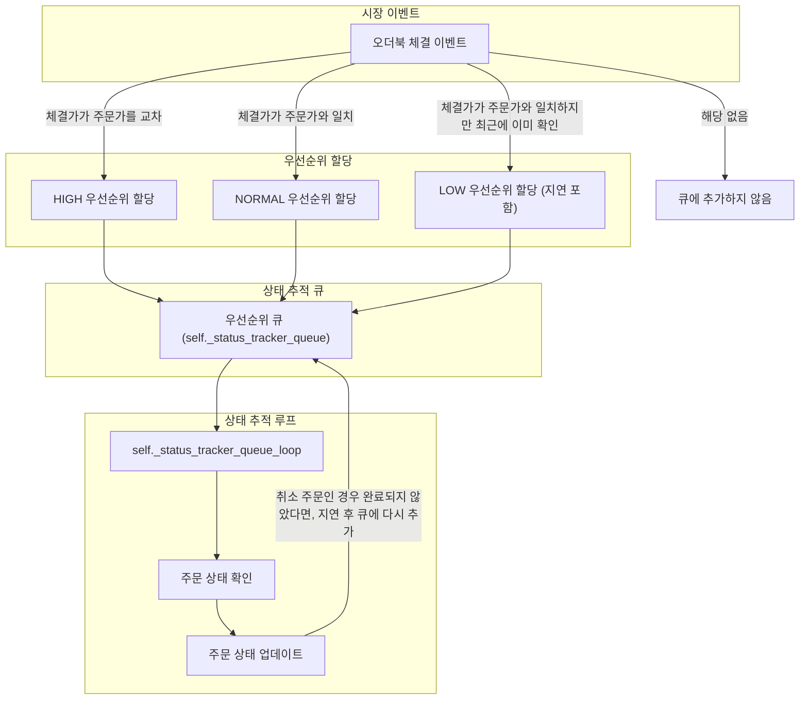

허밍봇(Hummingbot)은 **고빈도 거래(HFT)**와 **마켓 메이킹**에 특화된 오픈소스 알고리즘 트레이딩 프레임워크입니다.
2022년 11월, 저희 회사는 HFT 전략으로 전환을 검토하고 있었고, 당시 허밍봇은 HFT 전략에 최적화된 아키텍처를 갖춘 거의 유일한 프로덕션 수준의 오픈소스 솔루션이었습니다. 그런 이유로 제가 도입을 제안했고, 이후 주 플랫폼으로 채택되었습니다.

당시 허밍봇은 업비트를 공식적으로 지원하지 않았기 때문에, 업비트 전용 커넥터를 새로 개발하게 되었습니다. 다행히 거래소 커넥터 개발을 위한 가이드가 잘 정리되어 있어, 디렉토리 구조나 테스트 코드 작성법 등을 따라 비교적 수월하게 작업을 시작할 수 있었습니다.

{: width="600" }
_허밍봇 CEX 커넥터 개발 가이드_

## 첫 번째 난관: 실시간 API의 부재

개발 전 확인해야 할 API 체크리스트에서 예상치 못한 문제에 부딪혔습니다. 2022년 11월 기준, 업비트는 대부분의 API를 지원했지만 필수(Required) 항목인 **User Order/Trades Channel (Private WebSocket)**을 지원하지 않았습니다. (참고: 2025년 7월 현재는 지원됩니다.)

{: width="700" }
_허밍봇 CEX 커넥터 개발 가이드 - API 체크리스트_

이 API는 사용자의 주문이 체결될 때 해당 이벤트를 웹소켓을 통해 실시간으로 수신하는 핵심 기능입니다. 그렇다면 이 기능 없이 커넥터 개발은 불가능할까요?

해답을 찾기 위해 바이낸스(Binance) 커넥터 코드를 분석했습니다. 바이낸스는 웹소켓을 메인 채널로 사용하면서도, **REST API 기반의 폴링(Polling)**을 보조 수단으로 활용하여 미체결 주문의 상태를 주기적으로 업데이트하고 있었습니다. 네트워크 이슈로 웹소켓 연결이 끊겼을 때 발생할 수 있는 이벤트 누락을 폴링 루프가 보완해주는 구조였습니다.

이 아이디어를 차용하여, 업비트 커넥터에서는 폴링 기능만으로 주문 및 잔고 상태를 추적하기로 결정했습니다.

-----

## 기본 기능 구현

먼저 주문/취소 요청 등 기본적인 기능을 구현했습니다.

```python
class UpbitExchange(ExchangePyBase):
    # ...
    async def _place_order(
        self,
        order_id: str,
        trading_pair: str,
        amount: Decimal,
        trade_type: TradeType,
        order_type: OrderType,
        price: Decimal,
        **kwargs,
    ) -> Tuple[str, float]:
        order_result = None
        amount_str = f"{amount:f}"
        type_str = UpbitExchange.upbit_order_type(order_type, trade_type)
        side_str = UpbitExchange.upbit_trade_type(trade_type)
        symbol = await self.exchange_symbol_associated_to_pair(trading_pair=trading_pair)
        api_params = {
            "market": symbol,
            "side": side_str,
            "volume": amount_str,
            "ord_type": type_str,
            "identifier": order_id,
        }
        if order_type is OrderType.LIMIT or order_type is OrderType.LIMIT_MAKER:
            price_str = f"{price:f}"
            api_params["price"] = price_str

        try:
            order_result = await self._api_post(
                path_url=CONSTANTS.ORDER_REQUEST_PATH_URL,
                is_auth_required=True,
                limit_id=CONSTANTS.EXCHANGE_API_ORDER,
                data=api_params,
            )
            o_id = order_result["uuid"]
            transact_time = self._get_timestamp_from_isoformat(order_result["created_at"])
        except IOError as e:
            error_description = str(e)
            is_server_overloaded = "status is 503" in error_description
            if is_server_overloaded:
                o_id = CONSTANTS.UNKNOWN_EXCHANGE_ORDER_ID
                transact_time = self._time_synchronizer.time()
            else:
                raise
        return (o_id, transact_time)

    async def _place_cancel(self, order_id: str, tracked_order: InFlightOrder) -> bool:
        api_params = {"identifier": order_id}
        cancel_result = await self._api_delete(
            path_url=CONSTANTS.ORDER_DEFAULT_PATH_URL,
            is_auth_required=True,
            limit_id=CONSTANTS.EXCHANGE_API_DEFAULT,
            params=api_params,
        )
        if cancel_result.get("state") == CONSTANTS.ORDER_STATE_WAIT:
            return True
        return False    
    # ...
```

## 폴링(Polling) 기반의 초기 구현

초기 구현 전략은 Private WebSocket 관련 기능을 비활성화하고, 모든 상태 업데이트를 폴링에 의존하도록 구조를 변경하는 것이었습니다.

### 1\. WebSocket 기능 비활성화

먼저 Private WebSocket 채널을 담당하는 `UpbitAPIUserStreamDataSource` 클래스는 더미(dummy)로 만들고, 관련 태스크(`_user_stream_tracker_task`)는 실행되지 않도록 `None`을 할당했습니다.

```python
class UpbitAPIUserStreamDataSource(UserStreamTrackerDataSource):
    # NOTE: This is a dummy as Upbit does not provide user stream data.
    async def _connected_websocket_assistant(self): ...
    async def _subscribe_channels(self, websocket_assistant: WSAssistant): ...

class UpbitExchange(ExchangePyBase):
    # ...
    async def start_network(self):
        # ...
        if self.is_trading_required:
            # ...
            self._user_stream_tracker_task = None
            self._user_stream_event_listener_task = None
```
{: .nolineno }

### 2\. 밸런스와 주문 상태 폴링 루프 분리

부모 클래스인 `ExchangePyBase`의 `_status_polling_task`는 주문 상태와 밸런스를 동일한 주기로 업데이트합니다. 이는 폴링이 '백업' 역할일 때는 문제가 없지만, '메인' 역할인 업비트 커넥터에서는 두 업데이트 주기를 독립적으로 관리할 필요가 있었습니다. 따라서 아래와 같이 폴링 루프를 `ALL_BALANCES`와 `ORDER_STATUS` 두 개로 분리했습니다.

```python
async def start_network(self):
    # ...
    if self.is_trading_required:
        self._status_polling_task[CONSTANTS.PollType.ALL_BALANCES] = safe_ensure_future(
            self._update_all_balances_polling_loop()
        )
        self._status_polling_task[CONSTANTS.PollType.ORDER_STATUS] = safe_ensure_future(
            self._update_order_status_polling_loop()
        )
    # ...

async def _update_all_balances_polling_loop(self):
    while True:
        try:
            await self._poll_notifier[CONSTANTS.PollType.ALL_BALANCES].wait()
            await self._update_all_balances()
            # ...
        except asyncio.CancelledError:
            raise
        except Exception:
            # ...

async def _update_order_status_polling_loop(self):
    while True:
        try:
            await self._poll_notifier[CONSTANTS.PollType.ORDER_STATUS].wait()
            await self._update_order_status()
            # ...
        except asyncio.CancelledError:
            raise
        except Exception:
            # ...
```
{: .nolineno }

### 3\. 폴링 주기 설정

분리된 각 폴링 루프의 실행 간격은 `tick` 메서드 내에서 `_poll_notifier` 이벤트를 통해 제어됩니다.

```python
def tick(self, timestamp: float):
    # ...
    last_recv_diff = timestamp - self._orderbook_ds.last_recv_time
    order_status_poll_interval = (
        self.SHORT_POLL_INTERVAL if last_recv_diff > self.TICK_INTERVAL_LIMIT else self.LONG_POLL_INTERVAL
    )

    self._set_poll_notifier(timestamp, CONSTANTS.PollType.ALL_BALANCES, self.UPDATE_BALANCE_POLL_INTERVAL)
    self._set_poll_notifier(timestamp, CONSTANTS.PollType.ORDER_STATUS, order_status_poll_interval)
    # ...

def _set_poll_notifier(self, timestamp: float, poll_type: CONSTANTS.PollType, poll_interval: float) -> None:
    last_tick = int(self._last_timestamp / poll_interval)
    current_tick = int(timestamp / poll_interval)
    if current_tick > last_tick:
        self._poll_notifier[poll_type].set()
```
{: .nolineno }

부모 클래스에서는 웹소켓 수신이 원활하지 않을 가능성이 있을 때(마지막 오더북 이벤트 수신 후 1분 초과)는 5초(`SHORT_POLL_INTERVAL`), 원활할 때는 120초(`LONG_POLL_INTERVAL`) 간격으로 주문 상태를 폴링합니다. 하지만 업비트 커넥터에서는 폴링이 메인 방식이므로, 초기에는 `SHORT_POLL_INTERVAL`과 `LONG_POLL_INTERVAL` 모두 **1초**와 같이 짧은 값으로 동일하게 설정했습니다. 추후 적응형 폴링 적용 시 기본 값(5, 120초)으로 복귀시킬 것입니다.

### 4\. API 호출 최적화

`ExchangePyBase`에서는 주문 상태 확인 API와 거래 내역 확인 API를 별도로 호출했지만, 업비트는 주문 상태 확인 API 응답에 거래 내역 정보가 포함되어 있습니다. 불필요한 호출을 줄이기 위해 두 기능을 한 번의 API 호출로 처리하도록 `_update_order_status` 메서드를 수정했습니다.

```python
# 기존 ExchangePyBase 로직
async def _update_order_status(self):
    await self._update_orders_fills(orders=list(self._order_tracker.all_fillable_orders.values()))
    await self._update_orders()
```
{: .nolineno }
```python
# 변경된 업비트 커넥터 로직
async def _update_order_status(self):
    all_fillable_orders = self._order_tracker.updatable_all_fillable_orders.copy()
    in_flight_orders = self.updatable_in_flight_orders.copy()

    responses = await self._request_orders_status_with_fills(all_fillable_orders)

    await self._update_orders_fills(orders=all_fillable_orders.values(), responses=responses)
    await self._update_orders(orders=in_flight_orders, responses=responses)
```
{: .nolineno }

### 5\. 그 외

그 외에 오더북 파싱, 인증, 유틸리티 클래스 등을 가이드에 따라 모두 구현하고 테스트 코드 작성을 완료했습니다.

**테스트 코드**
```python
class UpbitExchangeTests(AbstractExchangeConnectorTests.ExchangeConnectorTests):
    # ...
    @aioresponses()
    def test_update_order_status_when_filled(self, mock_api):
        self._simulate_trading_fees_initialized()

        self.exchange._set_current_timestamp(1640780000)
        request_sent_event = asyncio.Event()

        self.exchange.start_tracking_order(
            order_id="11",
            exchange_order_id=str(self.expected_exchange_order_id),
            trading_pair=self.trading_pair,
            order_type=OrderType.LIMIT,
            trade_type=TradeType.BUY,
            price=Decimal("10000"),
            amount=Decimal("1"),
        )
        order: InFlightOrder = self.exchange.in_flight_orders["11"]

        url = self.configure_completely_filled_order_status_response(
            order=order, mock_api=mock_api, callback=lambda *args, **kwargs: request_sent_event.set()
        )

        if not self.is_order_fill_http_update_included_in_status_update:
            # If the fill events will not be requested with the order status, we need to manually set the event
            # to allow the ClientOrderTracker to process the last status update
            order.completely_filled_event.set()
        self.async_run_with_timeout(self.exchange._update_order_status())
        # Execute one more synchronization to ensure the async task that processes the update is finished
        self.async_run_with_timeout(request_sent_event.wait())

        order_status_request = self._all_executed_requests(mock_api, url)[0]
        self.validate_auth_credentials_present(order_status_request)
        self.validate_order_status_request(order=order, request_call=order_status_request)

        self.async_run_with_timeout(order.wait_until_completely_filled())
        self.assertTrue(order.is_done)

        if self.is_order_fill_http_update_included_in_status_update:
            self.assertTrue(order.is_filled)

            fill_event: OrderFilledEvent = self.order_filled_logger.event_log[0]
            self.assertEqual(self.exchange.current_timestamp, fill_event.timestamp)
            self.assertEqual(order.client_order_id, fill_event.order_id)
            self.assertEqual(order.trading_pair, fill_event.trading_pair)
            self.assertEqual(order.trade_type, fill_event.trade_type)
            self.assertEqual(order.order_type, fill_event.order_type)
            self.assertEqual(order.price, fill_event.price)
            self.assertEqual(order.amount, fill_event.amount)
            self.assertEqual(self.expected_fill_fee, fill_event.trade_fee)

        buy_event: BuyOrderCompletedEvent = self.buy_order_completed_logger.event_log[0]
        self.assertEqual(self.exchange.current_timestamp, buy_event.timestamp)
        self.assertEqual(order.client_order_id, buy_event.order_id)
        self.assertEqual(order.base_asset, buy_event.base_asset)
        self.assertEqual(order.quote_asset, buy_event.quote_asset)
        self.assertEqual(
            order.amount if self.is_order_fill_http_update_included_in_status_update else Decimal(0),
            buy_event.base_asset_amount,
        )
        self.assertEqual(
            order.amount * order.price if self.is_order_fill_http_update_included_in_status_update else Decimal(0),
            buy_event.quote_asset_amount,
        )
        self.assertEqual(order.order_type, buy_event.order_type)
        self.assertEqual(order.exchange_order_id, buy_event.exchange_order_id)
        self.assertNotIn(order.client_order_id, self.exchange.in_flight_orders)
        self.assertTrue(self.is_logged("INFO", f"BUY order {order.client_order_id} completely filled."))

    # ...
    def test_get_order_price_quantum_for_krw_market(self):
        cases = [
            (10000000, 1000),
            (3000000, 1000),
            (2000000, 1000),
            (1500000, 500),
            (1000000, 500),
            (750000, 100),
            (500000, 100),
            (300000, 50),
            (100000, 50),
            (50000, 10),
            (10000, 10),
            (5000, 1),
            (1000, 1),
            (500, 0.1),
            (100, 0.1),
            (50, 0.01),
            (10, 0.01),
            (5, 0.001),
            (1, 0.001),
            (0.5, 0.0001),
            (0.1, 0.0001),
            (0.05, 0.00001),
            (0.01, 0.00001),
            (0.001, 0.000001),
            (0.0001, 0.0000001),
            (0.00001, 0.00000001),
            (0, None),
            (-1000, None),
        ]
        for price, quantum in cases:
            with self.subTest(price=price):
                if quantum is not None:
                    self.assertEqual(
                        self.exchange._get_order_price_quantum_for_krw_market(Decimal(str(price))),
                        Decimal(str(quantum)),
                    )
                else:
                    with self.assertRaises(ValueError):
                        self.exchange._get_order_price_quantum_for_krw_market(Decimal(str(price)))
    
    # ...
    def _order_cancelation_request_successful_mock_response(self, order: InFlightOrder) -> Any:
        return {
            "uuid": order.exchange_order_id,
            "side": UpbitExchange.upbit_trade_type(order.trade_type),
            "ord_type": UpbitExchange.upbit_order_type(order.order_type, order.trade_type),
            "price": str(order.price),
            "state": "wait",
            "market": self.exchange_symbol_for_tokens(self.base_asset, self.quote_asset),
            "created_at": "2018-04-10T15:42:23+09:00",
            "volume": str(order.amount),
            "remaining_volume": str(order.amount),
            "reserved_fee": "0.0015",
            "remaining_fee": "0.0015",
            "paid_fee": "0.0",
            "locked": "1.0015",
            "executed_volume": str(Decimal("0")),
            "trades_count": 0,
        }

    def _order_status_request_completely_filled_mock_response(self, order: InFlightOrder) -> Any:
        side = UpbitExchange.upbit_trade_type(order.trade_type)
        return {
            "uuid": order.exchange_order_id,
            "side": side,
            "ord_type": UpbitExchange.upbit_order_type(order.order_type, order.trade_type),
            "price": str(order.price),
            "state": "done",
            "market": self.exchange_symbol_for_tokens(self.base_asset, self.quote_asset),
            "created_at": "2019-01-04T13:48:09+09:00",
            "volume": str(order.amount),
            "remaining_volume": "0.0",
            "reserved_fee": "0.0",
            "remaining_fee": "0.0",
            "paid_fee": "2140.0",
            "locked": "0.0",
            "executed_volume": str(order.amount),
            "trades_count": 1,
            "trades": [
                {
                    "market": self.exchange_symbol_for_tokens(self.base_asset, self.quote_asset),
                    "uuid": "9e8f8eba-7050-4837-8969-cfc272cbe083",
                    "price": str(order.price),
                    "volume": str(order.amount),
                    "funds": str(order.price * order.amount),
                    "side": side,
                    "created_at": "2019-01-04T13:48:15+09:00",
                }
            ],
        }

    def _order_status_request_canceled_mock_response(self, order: InFlightOrder) -> Any:
        return {
            "uuid": order.exchange_order_id,
            "side": UpbitExchange.upbit_trade_type(order.trade_type),
            "ord_type": UpbitExchange.upbit_order_type(order.order_type, order.trade_type),
            "price": str(order.price),
            "state": "cancel",
            "market": self.exchange_symbol_for_tokens(self.base_asset, self.quote_asset),
            "created_at": "2019-01-04T13:48:09+09:00",
            "volume": str(order.amount),
            "remaining_volume": str(order.amount),
            "reserved_fee": "0.0",
            "remaining_fee": "0.0",
            "paid_fee": "0.0",
            "locked": "0.0",
            "executed_volume": "0.0",
            "trades_count": 0,
            "trades": [],
        }
    # ...
```
{: .nolineno }
-----

## 단순 폴링의 한계: API 요청 제한

초기 구현은 잘 작동했지만, 곧 문제를 발견했습니다.

> 한 코인의 매수 1호가부터 10호가까지 10개의 주문을 한 번에 넣는다고 가정해봅시다. 주문이 접수되면 매초마다 10개 주문 전체의 상태를 확인하기 위해 **10번의 API 요청**이 발생합니다. 만약 이런 거래를 3개의 코인에 대해 동시에 실행한다면, 초당 요청은 **30회(`10 * 3`)**에 달해 업비트의 **초당 API 요청 제한(30회)**에 즉시 도달하게 됩니다.

이러한 비효율을 해결하고 안정성을 확보하기 위해 **적응형 폴링(Adaptive Polling)** 방식을 도입했습니다.

-----

## 해결책: 우선순위 큐를 활용한 적응형 폴링(Adaptive Polling)

적응형 폴링의 핵심은 모든 미체결 주문을 동일한 주기로 확인하는 대신, **체결 가능성이 높은 주문을 더 자주, 낮은 주문은 더 드물게 확인**하여 API 호출을 효율적으로 관리하는 것입니다. 이를 위해 **우선순위 큐(Priority Queue)**를 도입했습니다. 전체적인 흐름은 다음과 같습니다.



### 1\. 우선순위 큐 구조

`asyncio.PriorityQueue`를 상속한 커스텀 큐(`self._status_tracker_queue`)를 사용하여 주문별로 세 가지 우선순위를 부여해 관리합니다.

  - **HIGH**: 체결이 확실한 주문 (예: 매수 주문 가격 \> 현재 체결가)
  - **NORMAL**: 체결 가능성이 있는 주문 (예: 주문 가격 == 현재 체결가)
  - **LOW**: 체결 가능성이 있으나 최근에 이미 확인한 주문 (중복 폴링 방지, 지연 후 재확인)

### 2\. 이벤트 기반 주문 감지

오더북의 체결(Trade) 이벤트가 발생할 때마다, 해당 이벤트에 영향을 받을 수 있는 미체결 주문들을 선별하여 우선순위에 따라 큐에 추가합니다.

  - **HIGH/NORMAL** 우선순위 주문은 즉시 큐에 추가됩니다.
  - **LOW** 우선순위 주문은 짧은 시간(`STATUS_TRACKER_QUEUE_LOW_PRIORITY_MIN_INTERVAL`) 내 불필요한 중복 확인을 막기 위해 일정 시간 지연 후 큐에 추가됩니다.
  
### 3\. 주문 상태 업데이트 루프

별도의 백그라운드 태스크(`_status_tracker_queue_loop`)가 큐에서 우선순위가 가장 높은 주문부터 꺼내어 상태를 업데이트합니다. 이 방식을 통해 API 호출이 전체적으로 분산되고, 중요한 주문이 먼저 처리됩니다.

```python
async def _status_tracker_queue_loop(self):
    while True:
        try:
            async for _, client_order_id in self._iter_status_tracker_queue():
                order = self._order_tracker.fetch_order(client_order_id)
                if (order.is_open or not order.is_done) and self._order_tracker._can_update_order(order):
                    await self._update_an_order_status(order)
                    if order.is_pending_cancel_confirmation:
                        safe_ensure_future(
                            self._status_tracker_queue.put_nowait_with_delay(
                                (CONSTANTS.StatusTrackerQueuePriority.HIGH.value, order.client_order_id),
                                self.STATUS_TRACKER_QUEUE_CANCEL_MIN_INTERVAL,
                            )
                        )
        except asyncio.CancelledError:
            raise
        except Exception:
            # ...

async def _iter_status_tracker_queue(self) -> AsyncIterable[Tuple[int, str]]:
    while True:
        try:
            yield await self._status_tracker_queue.get()
        except asyncio.CancelledError:
            raise
        except Exception:
            # ...
```
{: .nolineno }

### 4\. 실제 코드 예시

아래는 이벤트 발생 시 주문의 우선순위를 결정하고 큐에 추가하는 로직의 일부입니다.

```python
class PriorityQueue(asyncio.PriorityQueue):
    async def put_nowait_with_delay(self, item: Any, delay: float) -> None:
        await asyncio.sleep(delay)
        self.put_nowait(item)
```
{: .nolineno }
```python
# 짧은 시간 내 중복 확인을 막기 위해 이용하는 TTL 캐시
self._status_tracker_cache = TTLCache(
    maxsize=self.STATUS_TRACKER_CACHE_MAXSIZE, ttl=self.STATUS_TRACKER_QUEUE_LOW_PRIORITY_MIN_INTERVAL
)
```
{: .nolineno }
```python
# 주문별 우선순위 큐에 추가하는 로직 (이벤트 발생 시)
priority = None
if (order.trade_type == TradeType.BUY and order.price > price) or \
   (order.trade_type == TradeType.SELL and order.price < price):
    priority = CONSTANTS.StatusTrackerQueuePriority.HIGH.value
elif order.price == price:
    if client_order_id in self._status_tracker_cache:
        priority = CONSTANTS.StatusTrackerQueuePriority.LOW.value
    else:
        priority = CONSTANTS.StatusTrackerQueuePriority.NORMAL.value

# 큐에 우선순위별로 추가
if priority == CONSTANTS.StatusTrackerQueuePriority.HIGH.value:
    self._status_tracker_queue.put_nowait((priority, order.client_order_id))
elif priority == CONSTANTS.StatusTrackerQueuePriority.NORMAL.value:
    self._status_tracker_queue.put_nowait((priority, order.client_order_id))
    self._status_tracker_cache[client_order_id] = self.current_timestamp
elif priority == CONSTANTS.StatusTrackerQueuePriority.LOW.value:
    delay = max(0, self.STATUS_TRACKER_QUEUE_LOW_PRIORITY_MIN_INTERVAL + (self._status_tracker_cache[client_order_id] - self.current_timestamp))
    safe_ensure_future(
        self._status_tracker_queue.put_nowait_with_delay((priority, client_order_id), delay)
    )
    self._status_tracker_cache[client_order_id] += self.STATUS_TRACKER_QUEUE_LOW_PRIORITY_MIN_INTERVAL
```
{: .nolineno }

### 5\. 효과

이 구조를 도입함으로써 **체결 가능성이 높은 주문은 실시간에 가깝게 상태를 확인**하고, **그 외 주문에 대한 불필요한 API 호출은 대폭 줄여** 업비트의 요청 제한을 효율적으로 준수할 수 있게 되었습니다. 결과적으로 여러 코인에 다수의 주문을 동시에 실행하는 상황에서도 API Rate Limit에 도달하지 않고 안정적으로 주문 상태를 추적하는 견고한 커넥터를 완성할 수 있었습니다.

