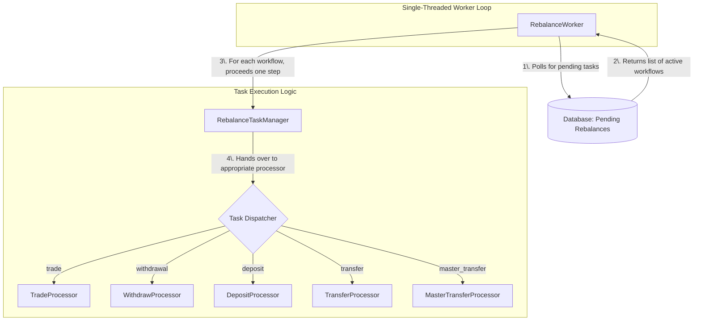

암호화폐 거래소 간 차익거래나 선물 포지션 관리를 자동화하다 보면 여러 계좌에 흩어진 자산을 정해진 경로로 정확하게 이동시켜야 하는 상황을 마주하게 됩니다. 이 과정을 **리밸런싱(Rebalancing)**이라고 부릅니다.

단순한 자산 이동처럼 보일 수 있지만, 실제로는 여러 단계의 거래, 출금, 입금 확인, 내부 이체가 얽힌 정교한 작업입니다. 이 글에서는 복잡한 리밸런싱 과정을 자동화하기 위해 **워크플로 오케스트레이션(Workflow Orchestration)** 시스템을 설계하고 개발한 경험을 공유합니다.
    
## 리밸런싱의 필요성

리밸런싱이 필요한 대표적인 상황은 다음과 같습니다.

1.  **거래소 간 차익거래**: 두 거래소 간 가격 차이를 이용해 수익을 내다보면 자산이 한쪽으로 쏠리게 됩니다. 예를 들어, A 거래소에서 원화(Quote Currency)로 비트코인(Base Currency)을 매수하고, B 거래소에서 비트코인을 매도하는 전략을 반복하면 잔고는 아래와 같이 변합니다.

    **초기 잔고 상태**
  
    | 거래소       | Base Currency (BTC) | Quote Currency (KRW/USDT) |
    | :----------- | :------------------ | :------------------------ |
    | **A 거래소** | 0%                  | 100%                      |
    | **B 거래소** | 100%                | 0%                        |

    **거래 반복 후 잔고 상태**

    | 거래소       | Base Currency (BTC) | Quote Currency (KRW/USDT) |
    | :----------- | :------------------ | :------------------------ |
    | **A 거래소** | 100%                | 0%                        |
    | **B 거래소** | 0%                  | 100%                      |

    이 상태에서는 더 이상 차익거래를 할 수 없으므로, 자산을 초기 상태로 되돌리는 리밸런싱이 필요합니다.

2.  **선물 포지션 증거금 관리**: 현물과 선물 포지션을 연계 운용할 때, 선물 포지션의 증거금이 부족해져 청산 위험이 커지면 현물 계좌의 자산을 신속하게 선물 계좌로 이체하여 증거금을 보충해야 합니다.

제가 해결해야 했던 문제는 여러 종류의 계정(개인/법인, 마스터/서브, 현물/선물)을 거쳐 자산을 이동시켜야 하는 훨씬 복잡한 경우였습니다. 전체 경로는 다음과 같습니다.

> **A 거래소 개인 현물 계정** (매수/출금) → **B 거래소 개인 현물 계정** (입금 확인/출금) → **B 거래소 법인 마스터 현물 계정** (입금 확인/내부 이체) → **B 거래소 법인 서브 현물 계정** (입금 확인/매도/내부 이체) → **B 거래소 법인 서브 선물 계정**

이처럼 복잡하고 가변적인 프로세스를 하드코딩으로 구현한다면, 경로가 일부만 변경되거나 새로운 경로가 추가될 때마다 코드를 수정하고 재배포해야 하는 유지보수의 어려움에 직면하게 됩니다.

-----

## 아키텍처 설계: 워크플로 오케스트레이션 시스템의 도입

이 문제를 효율적으로 해결하기 위해, 리밸런싱 전체 과정을 하나의 **워크플로(Workflow)**로 정의하고 이를 실행하는 오케스트레이션 시스템을 구축했습니다.

이 시스템에서 하나의 리밸런싱 경로는 여러 **태스크(Task)**의 순차적인 집합으로 구성된 **설정(Configuration)** 파일로 정의됩니다. 각 태스크는 거래(Trade), 출금(Withdraw), 입금(Deposit), 이체(Transfer) 등과 같은 원자적인 작업을 의미합니다.

이러한 접근 방식의 장점은 명확합니다.

  * **유연성 및 확장성**: 새로운 리밸런싱 경로가 필요할 때 메인 코드를 변경하는 대신 새로운 설정 파일만 추가하면 됩니다.
  * **유지보수 용이성**: 로직 변경이 필요할 때 코드 전체가 아닌 특정 설정 파일만 수정하면 되므로 관리가 용이합니다.
  * **재사용성**: 한 번 정의된 태스크는 다른 워크플로에서도 재사용할 수 있습니다.

워크플로는 아래와 같이 태스크의 리스트로 표현할 수 있습니다. 각 태스크는 이전 태스크의 실행 결과를 `"{$.<이전_태스크_이름>.<결과_필드>}"`와 같은 형식의 문자열 보간(String Interpolation)을 통해 자신의 입력값으로 참조할 수 있습니다.

```python
[
    # 1. A 거래소에서 Base Currency 매수 (TWAP)
    create_twap_trade_tasks(
        name="BUY_IN_SOURCE_SPOT",
        # ... TWAP 관련 파라미터들
        config=TradeTaskConfig.Format(
            account="{from_account}",
            trade_type=TradeType.BUY,
            base_currency="{interim_currency}",
            quote_amount="{from_amount}",
            # ...
        ),
    ),
    # 2. A 거래소에서 B 거래소로 Base Currency 출금
    RebalanceTask(
        name="WITHDRAW_FROM_SOURCE_SPOT_TO_INTERIM_SPOT",
        type=RebalanceTaskType.WITHDRAW,
        config=WithdrawTaskConfig.Format(
            from_account="{from_account}",
            to_account="{from_account.interim_account}",
            currency="{interim_currency}",
            # 이전 매수 태스크의 결과(체결 수량)를 참조
            amount="{$.buy_in_source_spot.refresh_result.extra.cumulative_amount_excluding_fee}",
            network=options.network,
        ),
    ),
    # 3. B 거래소에서 입금 완료 대기
    RebalanceTask(
        name="AWAIT_DEPOSIT_TO_INTERIM_SPOT",
        type=RebalanceTaskType.DEPOSIT,
        config=DepositTaskConfig.Format(
            account="{from_account.interim_account}",
            currency="{interim_currency}",
            # 이전 출금 태스크의 결과(트랜잭션 ID)를 참조
            txid="{$.withdraw_from_source_spot_to_interim_spot.refresh_result.result.txid}",
        ),
    ),
    # ... 이후 내부 출금, 입금 확인, 내부 이체, 매도, 선물 계정 이체 등 나머지 작업들
]
```
{: .nolineno }

-----

## 핵심 구성 요소

이러한 워크플로 시스템을 구현하기 위해 다음 세 가지 핵심 요소를 설계했습니다.

### 1\. 데이터 계층: 상태 지속성을 위한 ORM 모델

각 태스크의 요청 파라미터와 실행 결과(성공, 실패, 중간 상태 등)는 다음 태스크에서 참조하거나 추후 추적을 위해 데이터베이스에 영구적으로 저장되어야 합니다. 이를 위해 SQLAlchemy를 사용하여 모든 태스크 모델이 상속받는 `TaskBase` 추상 클래스를 정의했습니다.

```python
class TaskBase(Base):
    """모든 태스크 모델의 기반이 되는 추상 클래스"""
    __abstract__ = True

    # 태스크 요청 파라미터와 결과, 상태 갱신 결과를 JSON으로 저장
    request_params = Column(JSON)
    request_result = Column(JSON, default={})
    refresh_result = Column(JSON, default={})
    request_error = Column(Text)
    
    # ... 상태 업데이트 및 저장 관련 메서드들
```
{: .nolineno }

이 `TaskBase`를 상속하여 `Withdrawal`(출금), `Trade`(거래) 등 각 태스크에 특화된 ORM 모델을 구현함으로써 모든 태스크의 상태와 데이터를 일관되게 관리하고, 시스템이 중단되었다 재시작되어도 이전 상태를 복원하여 작업을 이어갈 수 있습니다. 

`Withdrawal`(출금) 모델은 다음과 같이 구현했습니다.

```python
class Withdrawal(TaskBase, TimestampMixin, SessionMixin):
    __tablename__ = "withdrawal"

    id = Column(Integer, primary_key=True)
    rebalance_state_id = Column(
        Integer, ForeignKey("rebalance_state.id"), nullable=False
    )
    rebalance_state = relationship("RebalanceState", back_populates="withdrawals")
    state = Column(String, nullable=False, default=states.WithdrawalState.CREATED.value)
    states = relationship("WithdrawalState")

    @property
    def state_class(self) -> type[WithdrawalState]:
        return WithdrawalState

    @property
    def uuid(self) -> str | None:
        try:
            return self.request_result["extra"]["uuid"]
        except KeyError:
            return

    @property
    def txid(self) -> str | None:
        try:
            return self.refresh_result["result"]["txid"]
        except (TypeError, KeyError):
            return

    # ...
```
{: .nolineno }

### 2\. 거래소 추상화 계층

암호화폐 거래소들은 저마다 다른 API 명세와 동작 방식을 가집니다. 이러한 차이를 극복하고 일관된 인터페이스로 거래소를 제어하기 위해 **추상화 계층(Abstraction Layer)**을 도입했습니다.

다양한 거래소 API를 표준화해주는 CCXT 라이브러리를 기반으로, CCXT가 표준화하지 못하는 세부 동작(예: 업비트의 시장가 매수 주문 처리 방식)까지 통일하기 위해 각 거래소별 **커넥터(Connector)**를 구현했습니다. 모든 커넥터는 아래 `ExchangeBase` 추상 클래스를 상속받습니다.

```python
class ExchangeBase(ABC):
    """거래소 커넥터의 인터페이스를 정의하는 추상 기본 클래스"""

    @abstractproperty
    def code(self) -> str: ...  # 거래소 코드 (e.g., "upbit")

    @abstractproperty
    def is_perpetual(self) -> bool: ...  # 현물/무기한 선물 여부
        
    @abstractproperty
    def is_withdrawal_fee_deducted_on_request(self) -> bool: ...  # 출금 요청 시 수량에서 수수료를 차감하는지 여부
        
    @abstractmethod
    def create_order(...) -> ExchangeResult: ...  # 주문 생성

    @abstractmethod
    def withdraw(...) -> ExchangeResult: ...  # 출금 요청

    @abstractmethod
    def fetch_deposit(...) -> ExchangeResult | None: ...  # 입금 조회
    
    # ... 기타 거래소 기능 추상 메서드들
```
{: .nolineno }

예를 들어 `UpbitExchange` 커넥터는 업비트 API의 고유한 특징(원화 마켓 최소 주문 금액, 호가 단위 등)을 캡슐화합니다. 이를 통해 시스템의 다른 부분에서는 거래소가 업비트인지 바이낸스인지 신경 쓸 필요 없이 표준화된 `create_order` 함수를 호출할 수 있습니다.

```python
class UpbitExchange(ExchangeBase):
    # 업비트 원화 마켓 최소 주문 금액
    KRW_MARKET_MIN_NOTIONAL_SIZE = Decimal("5000.0")

    @property
    def code(self) -> str:
        return "upbit"
    # ... 기타 프로퍼티 ...

    def create_order(
        self,
        symbol: str,
        type: str,
        side: str,
        amount: float | None = None,
        quote_amount: float | None = None,
        # ...
    ) -> ExchangeResult:
        # 업비트는 수량 기준 시장가 매수를 지원하지 않으므로 예외 처리
        if (type == "market" and side == "buy" and amount is not None):
            raise NotSupportedTradeRequestError(
                "Upbit does not support market buy with base amount."
            )

        _, quote_currency = split_trading_pair(symbol)
        if quote_currency == "KRW":
            # 원화 마켓의 경우 최소 주문 금액 및 가격 단위를 확인하고 조정
            # ... (최소 주문 금액 및 호가 단위 처리 로직) ...

        # CCXT의 create_order 메서드 호출
        result = self.exchange.create_order(
            symbol, type, side, amount or quote_amount, price, params=params
        )

        extra = dict(uuid=result["id"])
        return ExchangeResult(result=result, extra=extra)
    
    # ...
```
{: .nolineno }

### 3\. 태스크 처리 계층: 비동기 작업을 위한 프로세서

각 태스크의 실제 실행 로직은 **태스크 프로세서(Task Processor)**가 수행합니다. 출금이나 거래처럼 즉시 완료되지 않는 **비동기(Asynchronous)** 작업은 '요청'과 '상태 확인'의 두 단계로 나누어 처리해야 합니다.

이를 위해 모든 프로세서가 상속받는 `TaskProcessorBase` 추상 클래스를 정의했습니다.

```python
class TaskProcessorBase(ABC):
    """태스크 실행 로직을 정의하는 추상 기본 클래스"""

    def proceed(self) -> ExchangeResult | None:
        """태스크를 진행시키는 메인 메서드. 요청 전이면 request, 후면 refresh 호출"""
        if not self.is_requested:
            return self.request()
        else:
            return self.refresh()

    @abstractmethod
    def request(self) -> ExchangeResult:
        """거래소에 태스크를 최초로 요청"""
        ...

    @abstractmethod
    def refresh(self) -> ExchangeResult | None:
        """요청된 태스크의 현재 상태를 확인하고 갱신"""
        ...
```
{: .nolineno }

`WithdrawTaskProcessor`를 예로 들면, `request` 메서드는 거래소에 출금 API를 호출하고, `refresh` 메서드는 해당 출금이 완료되었는지 주기적으로 확인하는 로직을 담습니다.

```python
class WithdrawTaskProcessor(TaskProcessorBase):
    # ... (생성자 및 프로퍼티) ...

    def request(self) -> ExchangeResult:
        # 출금할 지갑 주소, 네트워크, 수량 등 파라미터 설정
        # ... (파라미터 설정 로직) ...
        
        # 거래소의 출금 수수료 정책에 따라 실제 출금할 수량을 계산
        amount_excluding_fee = self.config.amount
        if not self.exchange_service.is_withdrawal_fee_deducted_on_request:
            # ... (수수료 차감 로직) ...
            pass
        
        # ... (요청 파라미터 생성) ...
        self.withdrawal.update_request_params(params)

        try:
            # 거래소 추상화 계층을 통해 출금 API 호출
            result = self.exchange_service.withdraw(**params)
        except Exception as e:
            # 실패 시 상태 업데이트 및 예외 발생
            self.withdrawal.mark_failed()
            raise TaskProcessorRequestError from e

        # 요청 성공 시 상태를 'REQUESTED'로 변경하고 결과 저장
        self.withdrawal.update_state_with_result(
            states.WithdrawalState.REQUESTED.value, result.dict()
        )
        return result

    def refresh(self) -> ExchangeResult | None:
        # 거래소 추상화 계층을 통해 출금 상태 조회 API 호출
        result = self.exchange_service.fetch_withdrawal(
            currency=self.config.currency.code,
            uuid=self.withdrawal.uuid,
            atxid=self.withdrawal.atxid,
        )

        if result is None:
            return

        # 조회된 상태가 현재 상태와 다를 경우 DB 업데이트
        state = result.extra["status"]
        if state != self.withdrawal.state:
            self.withdrawal.update_state_with_result(state, result.dict())
        return result

    # ...
```
{: .nolineno }

-----

## 오케스트레이션 엔진: 비동기 단일 스레드 워커

이제 여러 워크플로를 동시에 효율적으로 실행할 오케스트레이션 엔진을 만들 차례입니다.

각 워크플로마다 별도의 프로세스나 스레드를 할당하는 방식은 자원 낭비가 심하고 상태 관리를 복잡하게 만듭니다. 저는 더 효율적인 **단일 스레드 비동기 워커(Single-Threaded Asynchronous Worker)** 모델을 채택했습니다. 이 워커는 이벤트 루프처럼 동작합니다.



워커의 동작 방식은 다음과 같습니다.

1.  주기적으로 데이터베이스에서 '미완료(pending)' 상태인 모든 리밸런싱 워크플로 목록을 가져옵니다.
2.  목록을 순회하며 각 워크플로의 다음 태스크를 **단 한 번만** 실행(`proceed`)합니다.
3.  만약 태스크가 출금 완료 대기처럼 블로킹(blocking)이 필요하면, 기다리지 않고 즉시 다음 워크플로로 넘어갑니다.
4.  모든 워크플로를 한 번씩 순회한 뒤, 잠시 대기했다가 1번 과정부터 반복합니다.

이러한 **비동기 논블로킹(Asynchronous Non-blocking)** 방식은 단일 스레드만으로 수많은 동시성 작업을 효율적으로 처리하여 리소스 사용량을 최소화하고 시스템 구조를 매우 단순하게 만듭니다.

워커는 다음 `execute_next_task_for_pending_rebalances` 함수에 의해 구동됩니다.

```python
def execute_next_task_for_pending_rebalances(session: Session) -> None:
    """미완료 리밸런싱에 대해 다음 작업을 실행합니다."""

    rebalances = Rebalance.list_pending(session)
    for rebalance in rebalances:
        task_manager = RebalanceTaskManager(session, rebalance)

        try:
            # 현재 워크플로의 다음 태스크를 한 단계 진행
            task_manager.proceed()
        except RebalanceAlreadyDoneError:
            logger.warning(f"Rebalance {rebalance.id} is already done.")
        except RebalanceTaskFailedError:
            logger.error(f"Rebalance {rebalance.id} failed.")
        except TaskProcessorRetryableRequestError:
            logger.warning(
                f"Rebalance {rebalance.id} failed on request temporarily and will be retried.",
                exc_info=True,
            )
        except TaskProcessorRequestError:
            logger.error(
                f"Rebalance {rebalance.id} failed due to the request error.",
                exc_info=True,
            )
        except TaskProcessorRefreshError:
            logger.warning(
                f"Rebalance {rebalance.id} failed on refresh temporarily and will be retried.",
                exc_info=True,
            )
        except Exception:
            logger.error(f"Rebalance {rebalance.id} failed.", exc_info=True)
```
{: .nolineno }

각 작업을 실질적으로 관리하는 클래스는 `RebalanceTaskManager`입니다.

```python
class RebalanceTaskManager:
    """리밸런싱에 포함된 태스크들을 관리합니다."""
    # ... (생성자) ...

    def proceed(self) -> None:
        """현재 태스크를 진행시킵니다. 태스크가 완료되면 다음 태스크를 생성합니다."""

        if self.rebalance.is_done:
            raise RebalanceAlreadyDoneError("Rebalance is already done.")

        # 현재 진행할 태스크의 프로세서를 초기화
        if self.current_processor is None:
            self.current_processor = self.init_current_processor()

        try:
            # 프로세서를 통해 태스크 한 단계 진행 (request 또는 refresh)
            self.current_processor.proceed()
        except (TaskProcessorRetryableRequestError, TaskProcessorRefreshError) as e:
            # 재시도 가능한 오류는 그대로 전파하여 다음 루프에서 재시도
            raise e
        except Exception as e:
            # 복구 불가능한 오류는 리밸런싱을 실패 처리
            self.rebalance.mark_failed()
            raise TaskProcessorUnexpectedError from e

        if self.current_processor.is_failed:
            self.rebalance.mark_failed()
            raise RebalanceTaskFailedError("Task failed.")

        # 현재 태스크가 완료되었는지 확인
        if self.current_processor.is_done:
            # 마지막 태스크였다면 리밸런싱을 성공 처리
            if self.rebalance.is_last_task:
                self.rebalance.mark_done()
                return
            # (다음 태스크를 준비하는 로직으로 이어짐)
      
    # ...
```
{: .nolineno }

-----

## 테스트 전략: 단위 테스트와 통합 테스트

암호화폐 관련 프로젝트에서 테스트는 선택이 아닌 필수입니다. 실제 자산을 이용한 테스트는 비용이 많이 들고 위험하므로, 코드 레벨에서 완벽에 가까운 검증을 마쳐야 합니다.

### 테스트 환경 구축

`conftest.py`에 인메모리 SQLite DB를 미리 정의해두었습니다.

```python
@pytest.fixture
def session(connection: Connection) -> Iterator[Session]:
    """테스트 후 롤백되는 DB 세션 제공"""
    transaction = connection.begin()
    session = Sessionmaker(bind=connection)
    yield session
    session.close()
    transaction.rollback()

@pytest.fixture(scope="module", autouse=True)
def set_up_database_structure(engine: Engine) -> None:
    """테스트 전 DB 스키마(테이블) 생성"""
    Base.metadata.create_all(engine)

@pytest.fixture(scope="module")
def connection(engine: Engine) -> Iterator[Connection]:
    """DB 커넥션 생성"""
    load_all_models()

    connection = engine.connect()
    yield connection
    connection.close()

@pytest.fixture(scope="module")
def engine() -> Engine:
    """인메모리 DB 엔진 생성"""
    return create_engine("sqlite:///:memory:")
```
{: .nolineno }

### 단위 테스트

단위 테스트는 시스템의 가장 작은 단위인 개별 `TaskProcessor`가 독립적으로 정확하게 동작하는지 검증합니다.
> 엄밀히 말해, 이 테스트는 외부 시스템인 DB와 연동하므로 단위 테스트가 아닌 통합 테스트에 해당합니다. 하지만 여기서는 인메모리 SQLite를 사용한 것까지는 편의상 단위 테스트로 부르겠습니다.

  * **테스트 대상**: `WithdrawTaskProcessor`, `TradeTaskProcessor` 등
  * **핵심 기법**: 외부 의존성인 거래소 API를 **모의 객체(Mock Object)**로 대체합니다. `FakeExchange`라는 가짜 커넥터를 만들어, API 호출에 대해 미리 준비된 응답(예: 출금 요청 시 성공, 상태 조회 시 처음엔 '처리 중' 다음엔 '완료')을 반환하도록 설정합니다.

    ```python
    class FakeExchange(ExchagneBase):
        """테스트 목적의 가상 거래소"""
        # ... (프로퍼티 설정) ...

        def _init_exchange(self, options: dict | None = None) -> None:
            self.exchange = Mock()

            # 출금 요청에 대한 모의(Mock) 응답 설정
            self.exchange.withdraw.return_value = {"id": "fake-withdrawal-id", ...}
            
            # 출금 상태 조회에 대한 모의 응답을 순차적으로 설정
            # 첫 번째 호출에서는 '처리 중(processing)', 두 번째 호출에서는 '완료(done)' 반환
            self.exchange.fetch_withdrawals.side_effect = [
                [{"id": "fake-withdrawal-id", "status": "processing", ...}],
                [{"id": "fake-withdrawal-id", "status": "done", ...}],
            ]
                
        # ... (다른 API 모의 설정) ...
    ```
    {: .nolineno }

  * **검증 목표**:
      * 프로세서가 API 응답을 올바르게 해석하는가?
      * 내부 상태(`state`)를 정확하게 변경하고 DB에 기록하는가?
      * 예외 상황(API 에러 등)을 적절히 처리하는가?
      * 시스템이 재시작되어도 중단된 지점부터 작업을 재개할 수 있는가?

아래는 `WithdrawTaskProcessor`에 대한 단위 테스트 예시입니다. 출금 요청(`request`)과 상태 확인(`refresh`)을 거치며 상태가 `CREATED` → `REQUESTED` → `PROCESSING` → `DONE` 순서로 잘 바뀌는지, 결과가 DB에 잘 저장되는지를 검증합니다.

```python
@pytest.mark.parametrize(
    "with_restart", [True, False], ids=["with_restart", "without_restart"]
)
def test_withdraw_task_processor(session: Session, with_restart: bool) -> None:
    # 테스트에 필요한 DB 데이터(계정, 지갑 등) 설정
    # ... (테스트 데이터 설정) ...

    withdrawal = Withdrawal.create(...)
    
    assert withdrawal.state == states.WithdrawalState.CREATED.value
    assert not withdrawal.request_params
    assert not withdrawal.request_result
    assert not withdrawal.refresh_result
    assert len(withdrawal.states) == 1
    assert withdrawal.states[0].state == states.WithdrawalState.CREATED.value

    # 테스트할 프로세서와 가상 거래소 초기화
    params = dict(
        from_account=account_upbit,
        to_account=account_binance,
        currency=interim_currency,
        amount=1.5,
        is_internal=False,
    )
    config = WithdrawTaskConfig.Value.parse_obj(params)
    exchange_service = FakeExchange()
    
    processor = WithdrawTaskProcessor(
        exchange_service=exchange_service, withdrawal=withdrawal, config=config
    )

    assert not processor.is_done
    assert not processor.is_failed

    # 1. 출금 요청 (proceed #1)
    result = processor.proceed()

    assert withdrawal.request_params == {
        "currency": "ETH",
        "amount": 1.5,
        "address": "0xb794f5ea0ba39494ce839613fffba74279579268",
        "tag": None,
        "network": None,
        "is_internal": False,
        "extra": None,
    }
    assert (
        withdrawal.request_result["extra"]["uuid"] == "71de6d3c28f14f7d9d6468914cfc5dec"
    )
    assert result.extra["uuid"] == "71de6d3c28f14f7d9d6468914cfc5dec"
    assert withdrawal.state == states.WithdrawalState.REQUESTED.value
    assert withdrawal.uuid == "71de6d3c28f14f7d9d6468914cfc5dec"
    assert len(withdrawal.states) == 2
    assert withdrawal.states[1].state == states.WithdrawalState.REQUESTED.value

    # 재시작 시에도 정상 작동하는지 확인
    if with_restart:
        session.refresh(withdrawal)
        processor = WithdrawTaskProcessor(
            exchange_service=exchange_service, withdrawal=withdrawal, config=config
        )

    # 2. 출금 상태 확인 - 처리 중 (proceed #2)
    result = processor.proceed()

    assert (
        withdrawal.refresh_result["extra"]["status"]
        == states.WithdrawalState.PROCESSING.value
    )
    assert withdrawal.state == states.WithdrawalState.PROCESSING.value
    assert withdrawal.txid == "131411253045"
    assert len(withdrawal.states) == 3
    assert withdrawal.states[2].state == states.WithdrawalState.PROCESSING.value

    # 재시작 시에도 정상 작동하는지 확인
    if with_restart:
        session.refresh(withdrawal)
        processor = WithdrawTaskProcessor(
            exchange_service=exchange_service, withdrawal=withdrawal, config=config
        )

    # 3. 출금 상태 확인 - 완료 (proceed #3)
    result = processor.proceed()

    assert (
        withdrawal.refresh_result["extra"]["status"]
        == states.WithdrawalState.DONE.value
    )
    assert withdrawal.refresh_result["extra"]["remainders"] == [
        {"currency": "ETH", "amount": 0.51, "reason": "withdrawal_min_amount"}
    ]
    assert withdrawal.state == states.WithdrawalState.DONE.value
    assert len(withdrawal.states) == 4
    assert withdrawal.states[3].state == states.WithdrawalState.DONE.value

    assert processor.is_done
    assert not processor.is_failed  
```
{: .nolineno }

### 통합 테스트

통합 테스트는 여러 태스크가 하나의 설정으로 묶여 완전한 워크플로로서 정상적으로 동작하는지 검증합니다.

  * **테스트 대상**: `RebalanceTaskManager`가 실행하는 전체 리밸런싱 시나리오
  * **핵심 기법**: 단위 테스트처럼 `FakeExchange`를 사용하지만, 매수, 출금, 입금 등 여러 태스크를 연속적으로 시뮬레이션합니다.
  * **검증 목표**:
      * 첫 태스크의 결과가 다음 태스크의 입력 값으로 정확히 전달되는가?
      * 전체 워크플로의 상태가 각 단계를 거치며 올바르게 전환되는가?
      * 최종적으로 워크플로가 'DONE' 상태가 되는가?      

```python
def test_rebalance_task_manager(session: Session) -> None:
    # 테스트에 필요한 DB 데이터(계정, 지갑 등) 설정
    # ... (테스트 데이터 설정) ...

    rebalance = Rebalance.create(
        session=session,
        config_id=RebalanceConfigID.TEST,
        from_account=account_upbit,
        to_account=account_binance_sub,
        from_currency=from_currency,
        interim_currency=interim_currency,
        to_currency=to_currency,
        from_amount=from_amount,
    )

    rebalance_config = RebalanceConfig(
        config_id=RebalanceConfigID.TEST,
        tasks=[
            RebalanceTask(
                name="BUY_IN_SOURCE_SPOT",
                type=RebalanceTaskType.TRADE,
                config=TradeTaskConfig.Format(
                    account="{from_account}",
                    order_type=OrderType.LIMIT,
                    trade_type=TradeType.BUY,
                    base_currency="{interim_currency}",
                    quote_currency="{from_currency}",
                    quote_amount="{from_amount}",
                ),
            ),
            RebalanceTask(
                name="WITHDRAW_FROM_SOURCE_SPOT_TO_INTERIM_SPOT",
                type=RebalanceTaskType.WITHDRAW,
                config=WithdrawTaskConfig.Format(
                    from_account="{from_account}",
                    to_account="{from_account.interim_account}",
                    currency="{interim_currency}",
                    amount="{$.buy_in_source_spot.refresh_result.result.amount}",
                ),
            ),
            RebalanceTask(
                name="AWAIT_DEPOSIT_TO_INTERIM_SPOT",
                type=RebalanceTaskType.DEPOSIT,
                config=DepositTaskConfig.Format(
                    account="{from_account.interim_account}",
                    currency="{interim_currency}",
                    txid="{$.withdraw_from_source_spot_to_interim_spot.refresh_result.result.txid}",
                ),
            ),
            RebalanceTask(
                name="TRANSFER_FROM_INTERIM_SPOT_TO_INTERIM_FUTURES",
                type=RebalanceTaskType.TRANSFER,
                config=TransferTaskConfig.Format(
                    account="{from_account.interim_account}",
                    from_account_type="spot",
                    to_account_type="future",
                    currency="{interim_currency}",
                    amount="{$.await_deposit_to_interim_spot.refresh_result.result.amount}",
                ),
            ),
            RebalanceTask(
                name="TRANSFER_FROM_INTERIM_MASTER_SPOT_TO_INTERIM_SUB_SPOT",
                type=RebalanceTaskType.MASTER_TRANSFER,
                config=MasterTransferTaskConfig.Format(
                    account="{to_account.master_account}",
                    from_account="{to_account.master_account}",
                    to_account="{to_account}",
                    from_account_type="SPOT",
                    to_account_type="SPOT",
                    currency="{interim_currency}",
                    amount="{$.transfer_from_interim_spot_to_interim_futures.refresh_result.result.amount}",
                ),
            ),
        ],
        result=RebalanceResultConfig.Format(
            to_amount="{$.transfer_from_interim_master_spot_to_interim_sub_spot.refresh_result.result.info.amount}"
        ),
    )
    rebalance.set_config(rebalance_config)

    rebalance_task_manager = RebalanceTaskManager(session, rebalance)

    assert rebalance_task_manager.rebalance.state == RebalanceStateType.CREATED.value
    with pytest.raises(NoTaskRunningError):
        assert rebalance_task_manager.rebalance.is_last_task

    # BUY_IN_SOURCE_SPOT
    rebalance_task_manager.proceed()

    assert rebalance_task_manager.rebalance.state == "buy_in_source_spot"
    assert not rebalance_task_manager.rebalance.is_last_task
    assert (
        rebalance_task_manager.rebalance.current_task_config.name
        == "BUY_IN_SOURCE_SPOT"
    )
    assert (
        rebalance_task_manager.rebalance.current_task.state
        == states.TradeState.REQUESTED.value
    )

    rebalance_task_manager.proceed()

    assert rebalance_task_manager.rebalance.state == "buy_in_source_spot"
    assert not rebalance_task_manager.rebalance.is_last_task
    assert (
        rebalance_task_manager.rebalance.current_task.state
        == states.TradeState.OPEN.value
    )

    rebalance_task_manager.proceed()

    assert rebalance_task_manager.rebalance.state == "buy_in_source_spot"
    assert not rebalance_task_manager.rebalance.is_last_task
    assert (
        rebalance_task_manager.rebalance.current_task.state
        == states.TradeState.DONE.value
    )

    # WITHDRAW_FROM_SOURCE_SPOT_TO_INTERIM_SPOT
    rebalance_task_manager.proceed()

    assert (
        rebalance_task_manager.rebalance.state
        == "withdraw_from_source_spot_to_interim_spot"
    )
    assert not rebalance_task_manager.rebalance.is_last_task
    assert (
        rebalance_task_manager.rebalance.current_task_config.name
        == "WITHDRAW_FROM_SOURCE_SPOT_TO_INTERIM_SPOT"
    )
    assert (
        rebalance_task_manager.rebalance.current_task.state
        == states.WithdrawalState.REQUESTED.value
    )
    assert rebalance_task_manager.rebalance.current_task.request_params == {
        "address": "0xb794f5ea0ba39494ce839613fffba74279579268",
        "amount": 0.001,
        "currency": "ETH",
        "tag": None,
        "network": None,
        "is_internal": False,
        "extra": None,
    }

    rebalance_task_manager.proceed()

    assert (
        rebalance_task_manager.rebalance.state
        == "withdraw_from_source_spot_to_interim_spot"
    )
    assert not rebalance_task_manager.rebalance.is_last_task
    assert (
        rebalance_task_manager.rebalance.current_task.state
        == states.WithdrawalState.PROCESSING.value
    )

    rebalance_task_manager.proceed()

    assert (
        rebalance_task_manager.rebalance.state
        == "withdraw_from_source_spot_to_interim_spot"
    )
    assert not rebalance_task_manager.rebalance.is_last_task
    assert (
        rebalance_task_manager.rebalance.current_task.state
        == states.WithdrawalState.DONE.value
    )

    # ... (AWAIT_DEPOSIT_TO_INTERIM_SPOT) ...
    
    # ... (TRANSFER_FROM_INTERIM_SPOT_TO_INTERIM_FUTURES) ...
    
    # ... (TRANSFER_FROM_INTERIM_MASTER_SPOT_TO_INTERIM_SUB_SPOT) ...
    
    # DONE
    rebalance_task_manager.proceed()

    assert rebalance_task_manager.rebalance.state == RebalanceStateType.DONE.value
    with pytest.raises(NoTaskRunningError):
        assert rebalance_task_manager.rebalance.is_last_task
    with pytest.raises(NoTaskRunningError):
        assert (
            rebalance_task_manager.rebalance.current_task.state
            == states.MasterTransferState.DONE.value
        )

    assert rebalance_task_manager.rebalance.is_done
    with pytest.raises(RebalanceAlreadyDoneError):
        rebalance_task_manager.proceed()

    assert rebalance_task_manager.rebalance.to_amount == Decimal("1.0")
```
{: .nolineno }

이러한 체계적인 테스트를 통해 실제 비용을 들이지 않고도 다양한 엣지 케이스와 버그를 사전에 발견하고 수정할 수 있었습니다.

## 결론

리밸런서 프로젝트는 단순한 자동화 스크립트 개발을 넘어, 복잡한 금융 워크플로를 유연하고 안정적으로 처리하는 오케스트레이션 시스템을 설계하고 구현하는 과정이었습니다. **워크플로 추상화**로 뼈대를 잡고, **비동기 단일 스레드 워커**로 효율적인 엔진을 얹었으며, 마지막으로 **체계적인 테스트 전략**을 통해 이 복잡한 시스템을 성공적으로 완성할 수 있었다고 생각합니다.

